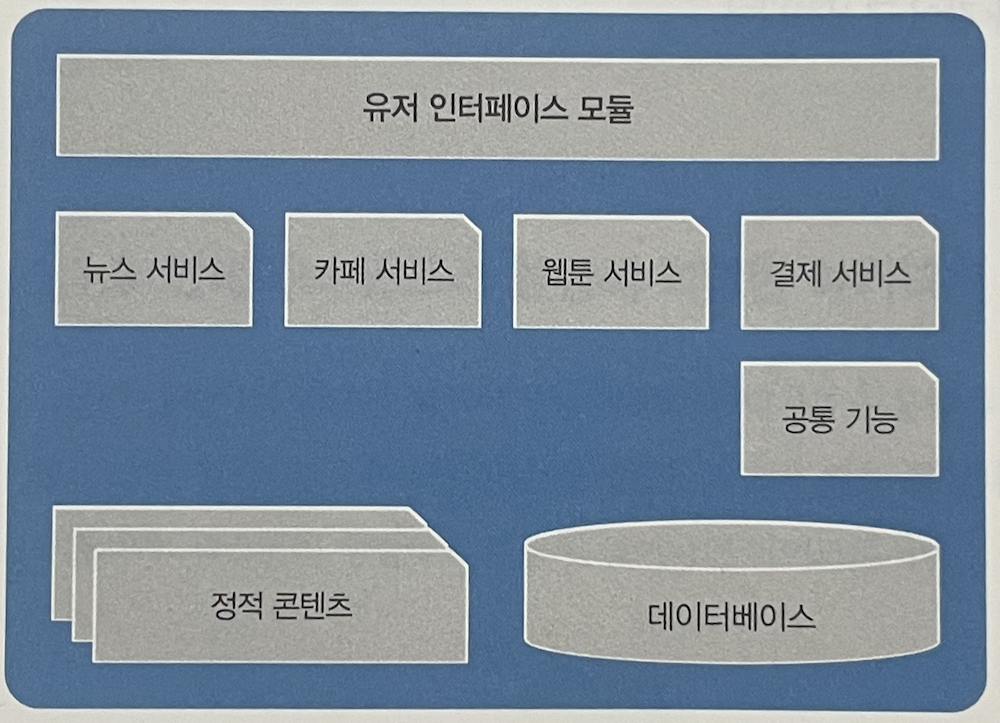
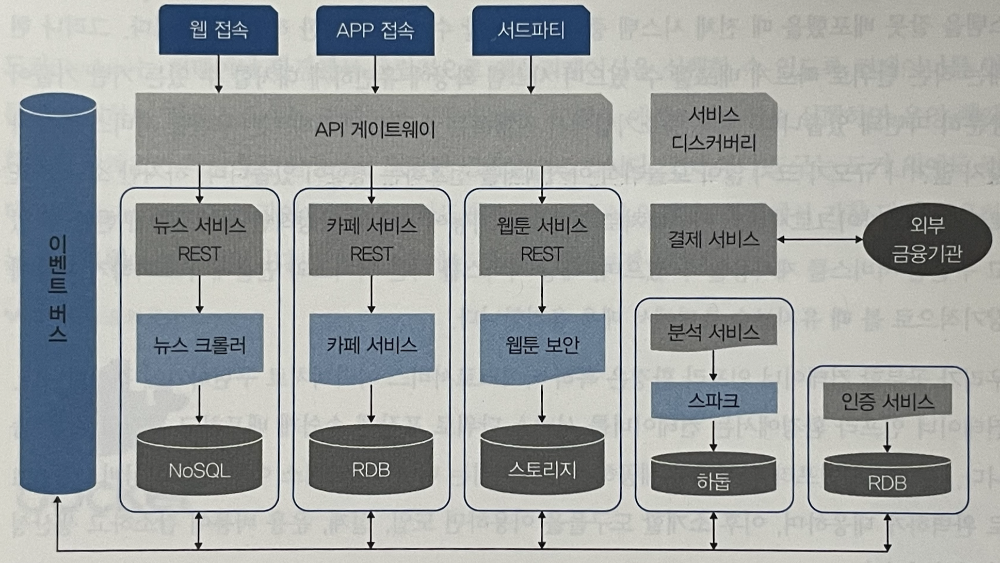

# 컨테이너 인프라 환경
> 컨테이너를 중심으로 구성된 인프라 환경
```
컨테이너 
- 하나의 운영체제 커널에서 다른 프로세스에 영향받지 않고 독립적으로 실행되는 프로세스 상태
- 가상화 상태에서 동작하는 프로세스보다 가볍고 빠르게 동작
```

## 모놀리식 아키텍처
> 하나의 큰 목적이 있는 서비스 또는 애플리케이션에 여러 기능이 통합되어 있는 구조

### 장점
- 소프트웨어가 하나의 결합된 코드로 구성되기 때문에 초기 단계에서 설계 용이
- 개발 단순
- 코드 관리 간편

### 단점
- 서비스를 운영하는 과정에서 수정이 많을 경우, 어떤 서비스에서 이뤄진 수정이 다른 서비스에 영향을 끼칠 가능성 ↑
- 서비스가 성장해 기능이 추가될수록 서비스 간 관계가 복잡해짐

### 예시
<p align="center"></p>

- 웹툰 서비스의 사용량의 증가로 인해 서버를 증설해야 할 경우 IaaS 덕분에 인프라 증설은 쉽다.
- 그러나, 뉴스 등의 다른 서비스가 포함된 애플리케이션까지 확장하는 것은 비효율적이며 수정 과정 중 에러 발생 시 전체 서비스를 이용할 수 없음.
__⇒ 해결 방안으로 마이크로서비스 아키텍처 등장__


## 마이크로서비스 아키텍처 (MSA, Microservices Architecture)
> 모놀리식 아키텍처와 같이 시스템 전체가 하나의 목적을 지향하지만 개별 기능을 하는 작은 서비스를 각각 개발해 
> 연결, 보안, 인증 등과 관련된 기능이 독립된 서비스를 구성하고 있으며 다른 서비스들도 독립적으로 동작할 수 있는 구조.

### 장점
- 개발된 서비스 재사용 용이
- 서비스 변경 시 다른 서비스에 영향을 미칠 가능성 ↓
- 사용량의 변화에 따라 특정 서비스만 확장 가능
- 사용자의 요구 사항에 따라 가용성을 즉각적으로 확보해야 하는 IaaS 환경에 적합

### 단점
- 복잡도 ↑
- 각 서비스가 서로 유기적으로 통신하는 구조로 설계되므로 네트워크를 통한 호출 횟수가 증가해 성능에 영향을 줄 수 있음.

### 예시
<p align="center"></p>

- 각 서비스와 관련된 기능과 데이터베이스를 독립적으로 가지는 구조
- 각 서비스는 API 게이트웨이와 REST API를 이용한 통신 방식으로 사용자(외부)의 요청 전달
- 어떤 서비스가 등록되어 있는지 파악하기 위해 서비스 디스커버리 사용
- 수많은 서비스의 내부 통신을 이벤트로 일원화하고 이를 효과적으로 관리하기 위해 이벤트 버스를 서비스로 구성
- 각 서비스는 필요한 기능이 특화된 데이터베이스 선택해 할당 가능


## 컨테이너 인프라 환경을 지원하는 도구

### 도커(Docker)
> 컨테이너 환경에서 독립적으로 애플리케이션을 실행할 수 있도록 컨테이너를 만들고 관리하는 것을 도와주는 컨테이너 도구

- 도커로 애플리케이션 실행 시 운영체제 환경에 관계 없이 독립적인 환경에서 일관된 결과 보장

### 쿠버네티스(Kubernetes)
> 다수의 컨테이너를 관리하는데 사용하며 컨테이너의 자동 배포와 배포된 컨테이너에 대한 동작 보증, 부하에 따른 동적 확장 등의 기능 제공

- 처음에는 다수의 컨테이너만 관리 
- 그러나 지금은 컨테이너 인프라에 필요한 기능을 통합하고 관리하는 솔루션으로 발전
- 컨테이너 인프라를 기반으로 API 게이트웨이, 서비스 디스커버리, 이벤트 버스, 인증 및 결제 등의 다양한 서비스를 효율적으로 관리할 수 있는 환경을 제공하고 내외부와 유연하게 연결

### 젠킨스(Jenkins)
- 지속적 통합(CI, Continuous Integration)과 지속적 배포(CD, Continuous Deployment)를 지원 <br>
⇒ 개발한 프로그램의 빌드, 테스트, 패키지화, 배포 단계를 모두 자동화해 개발 단계를 표준화
- 개발된 코드의 빠른 적응과 효과적인 관리를 통해 개발 생산성 ↑ <br>
⇒ 컨테이너 인프라 환경처럼 단일 기능을 빠르게 개발해 적용해야 하는 환경에 적합한 도구

### 프로메테우스와 그라파나
> 모니터링을 위한 도구
- 프로메테우스 → 상태 데이터 수집
- 그라파나 → 프로메테우스로 수집한 데이터를 관리자가 보기 좋게 시각화
- 프로메테우스 + 그라파나 ⇒ 컨테이너로 패키징되어 동작하며 최소한의 자원으로 쿠버네티스 클러스터의 상태를 시각적으로 표현
