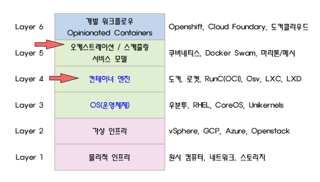

# 쿠버네티스(Kubernetes)
> 컨테이너 관리 도구, 컨테이너 오케스트레이션을 위한 솔루션

## 애플리케이션 실행 환경의 변화

- 위와 같이 3단계로 나눌 수 있다.
- 전통적인 환경에서의 배포 (On-premise), 가상 환경에서의 배포 (Virtual Machine), 컨테이너로의 배포 (Container) 로 이루어진다.

### 1. 전통적인 환경에서의 배포 (On-premise)

- 초기의 개발 환경은 물리적 서버에서 애플리케이션을 실행하였다.
- 단점은, 물리적 서버에 애플리케이션의 변경 사항을 쉽게 적용할 수 없고 물리적 서버를 유지/관리하는데도 비용이 많이 들어간다.

### 2. 가상 환경에서의 배포 (Virtual Machine)

- 물리적 환경에 대한 솔루션으로 가상화가 도입되었다.
- 단일 물리적 서버의 CPU에서 여러 대의 가상머신(VM)을 실행할 수 있게 되었다.
- 가상화를 사용하게 되면 애플리케이션 간 격리가 가능하고 상호 간의 보안 환경을 유지할 수 있다.

### 3. 컨테이너로의 배포 (Container)

- 컨테이너는 위의 가상머신과 유사하지만 컨테이너에는 자체 파일 시스템, CPU 공유, 메모리, 프로세스 공간 등이 있다.
- 기본 인프라에서 분리되기 때문에 클라우드 및 OS 배포 전반에 걸쳐 이식 가능하다.

## 도커의 등장
> 컨테이너 런타임 기술
- 컨테이너는 프로세스 단위의 격리 환경을 조성하고 있어 상호 간의 의존도를 낮춘다.
- 또한 VM에 비해 사이즈가 작아서 배포가 빠르고 성능 손실이 거의 없다.

- 도커 컨테이너로 서비스를 하게 되면 하나의 도커 이미지 안에 서비스 운영에 필요한 모든 것들이 들어 있어 개발자들이 손쉽게 협업을 할 수 있다.
- 또한 서비스 운영 환경과 개발 환경의 느슨한 결합으로 한쪽의 에러에도 다른 한쪽은 작업을 계속해서 이어나갈 수 있다.
- 도커 컨테이너는 배포가 쉽고 빠르며 시스템 의존성을 쉽게 업그레이드할 수 있어 스케일 아웃에 용이하다.
- CPU limit, Memory limit 등의 시스템 자원을 효율적으로 활용할 수가 있고 무엇보다도 가상머신보다 성능 면에서 뛰어나다.

- 하지만 이렇게 컨테이너화된 애플리케이션도 역시 관리를 해야 합니다. 컨테이너화된 어플리케이션이 다운이 되면 직접 재실행시켜야 합니다.
- 전통적인 방식과 VM보다 관리가 용이하지만 컨테이너의 스케일 아웃 장점 때문에 관리해야 하는 컨테이너 수가 많아지게 되면 그 또한 해결해야 한다.

## 컨테이너 오케스트레이션
- 컨테이너 오케스트레이션은 말 그대로 컨테이너들을 지휘하는 메인 컨트롤러가 있고 그 지휘에 맞춰 컨테이너의 배포, 관리, 확장, 네트워킹을 자동화하는 것을 말한다.
- 컨테이너를 사용하는 어떤 환경에서든 사용할 수 있다.

## 컨테이너 계층 구조

- 컨테이너 상위 계층에 오케스트레이션이 자리잡고 있다.
- 5단계의 도커 엔진으로 구현되고 있는 컨테이너를 재설계할 필요없이 각기 다른 환경 전반에 동일한 애플리케이션을 배포하는 데 도움이 된다.

## 쿠버네티스의 기능과 장점
- 실제 프로덕션 환경에서의 애플리케이션들은 여러 컨테이너에 걸쳐 있으며 이러한 컨테이너는 여러 서버 호스트에 배포되어야 한다.
- 이 때문에 컨테이너를 위한 보안은 멀티 레이어 구조로 되어 있고 복잡할 수 있다. 바로 여기에 쿠버네티스가 사용된다.
- 쿠버네티스는 이러한 워크로드를 위해 규모에 맞는 컨테이너를 배포하는 데 필요한 오케스트레이션 및 관리 기능을 제공한다.
- 쿠버네티스 오케스트레이션을 사용하면 여러 컨테이너에 걸쳐 애플리케이션 서비스를 구축하고 클러스터 전체에서 컨테이너의 일정을 계획하고 이러한 컨테이너를 확장하여 컨테이너의 상태를 지속적으로 관리할 수 있다.
- 또한 IT 보안을 한층 강화할 수 있습니다.

## 쿠버네티스 주요 구성 요소

### 클러스터
- 최소 하나 이상의 제어판(Control Plane, Master Node) 컴포넌트와, 이것과 연결된 몇 개의 워커노드로 구성되어 있다.

### 컨트롤 플레인(제어판)
- 쿠버네티스 노드를 제어하는 프로세스들이 모여있는 곳이다.
- 여기에서 모든 태스크 할당이 시작되고 제어판 컴포넌트는 클러스터가 잘 작동할 수 있게 돕는다. 

#### 1. etcd
- 쿠버네티스 클러스터의 모든 데이터를 담고 있는 key-value 저장소이다.
- 인프라를 원하는 상태로 만들기 위해 정상 상태에 대한 snapshot 및 관리에 필요한 메타 데이터를 저장한다.
#### 2. kube-api-server
- 쿠버네티스 클러스터의 허브로써 클라이언트와 etcd에 저장된 데이터 사이의 상호작용을 중개한다.
- 사용자(운영자), 클러스터 내 구성요소, 그리고 외부 컴포넌트가 서로 통신 할 수 있도록 HTTP API를 제공한다.
##### kube-api-server 작동 원리

#### 3. kube-scheduler
- 새로운 Pod를 감지하여 어떤 워커노드를 실행시킬지 선택하는 역할을 한다.
- 노드의 현재 상태와 Pod의 요구사항을 체크하고, 노드에 라벨을 부여한다.
#### 4. kube-conroller-manager
- API 서버를 통해 클러스터의 다양한 컴포넌트들의 상태를 감지하고, 원하는 상태로 만드는 역할을 한다.
- 다양한 컨트롤러가 하나로 패키징되어 단일 프로세스 내에서 실행되게 한다.

### 워커노드
- kubelet이라는 프로세스가 돌아가고 있는데, 이 kubelet은 다른 노드와 서로 통신하거나 컨테이너를 실행하는 등의 task를 실행할 수 있게 한다.
- 한 개 이상의 컨테이너가 자리 잡고 있으며, 워커 노드는 실제로 애플리케이션이 실행되고 있는 곳이라고 할 수 있다.

#### 1. kubelet
- 각 노드에서 실행되는 기본 노드 에이전트이다. 일종의 데몬이라고 생각할 수 있다.
- 컨테이너를 생성, 삭제하고 상태를 모니터링하며 마스터 노드와 통신을 담당 역할을 한다.
- kubelet이 작동하는 원리는 PodSpec 측면에서 작동한다. 파일로 명시된 PodSpec 부분에 그 코드에 설명된 컨테이너가 실행되고 정상적으로 작동하는지를 확인한다.
- kubelet은 쿠버네티스에서 생성되지 않은 컨테이너는 관리하지 않는다.

#### 2. kube-proxy

- 모든 워커 노드마다 실행되는 네트워크 프록시이다.
- 다른 Pod 간의 네트워크 통신과 클러스터 바깥에서 Pod으로 네트워크 통신을 할 수 있게 해준다.
- 성능 상의 이유로 별도의 프록시 프로그램 대신 iptable 또는 IPVS를 사용한다. 즉 설정만 관리하게 된다.

#### 3. Pod

- 단일 노드에 배포된 하나 이상의 컨테이너 그룹이다.
- Pod에 있는 모든 컨테이너는 IP 주소, IPC, 호스트 이름, 기타 리소스를 공유한다.
