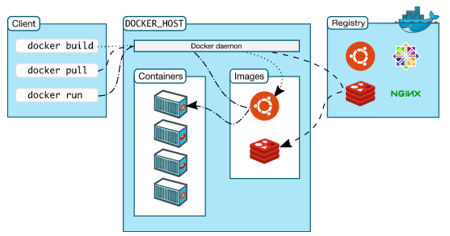

# 도커의 개요
## 도커란?
> 어플리케이션을 컨테이너(Container)로써 조금 더 쉽게 사용할 수 있게 만들어진 오픈소스 프로젝트  
> Go 언어로 작성되어 있음

- 도커는 컨테이너 기반의 가상화 도구이며, 어플리케이션을 환경에 구애받지 않고 실행하는 기술이라고 할 수 있다.
- 기존에 사용되던 가상화 기법인 가상 머신(Virtual Machine)과는 달리 도커 컨테이너는 성능의 손실이 거의 없어서 많이 사용된다.
- 도커와 관련된 프로젝트는 도커 컴포즈(Docker Compose), 도커 허브(Docker Hub) 등 여러 가지가 존재하지만, 일반적으로 도커라고 하면 도커 엔진(Docker Engine)을 의미로 많이 사용된다.
  - 도커 엔진은 컨테이너를 생성하고 관리하는 주체로, 컨테이너를 제어하고 다양한 기능을 제공하는 도커의 주 프로젝트이며,
  - 도커의 여러 프로젝트들은 도커 엔진을 좀 더 효율적으로 사용하기 위한 것이므로 도커 엔진이 핵심이라고 할 수 있다.

## 가상 머신 vs 컨테이너
### 가상 머신
- 기존의 가상화 기술은 하이퍼바이저(Hypervisor)라는 것을 이용하여 여러 개의 OS를 하나의 Host에서 생성하여 사용하는 방식이다. 
- 여기서 하이퍼바이저에 의해 생성되고 관리되는 OS는 Guest OS라고 하며, 각 Guest OS는 다른 Guest OS와는 완전히 독립된 공간과 시스템 자원(Resource)를 할당받아 사용하게 된다.
- 그러나 가상머신에서 각종 시스템 리소스를 가상화하고, 독립된 공간을 생성하는 작업은 하이퍼바이저를 반드시 거치기 때문에
  - 일반 Host에 비해 성능의 손실이 발생하며,
  - Guest OS를 사용하기 위한 라이브러리, 커널 등을 모두 포함하고 있기 때문에 가상머신을 배포하기 위한 이미지를 만들었을 때 이미지의 크기는 매우 크다.
- 즉, 가상머신은 완벽한 OS를 생성할 수는 있지만, 일반 Host에 비해서 성능이 많이 떨어지고 매우 큰 용량을 가진 이미지를 어플리케이션으로 배포하기에는 부담스럽다는 단점이 존재한다.

### 컨테이너
- 가상화된 공간을 생성하기 위해 리눅스의 자체 기능인 chroot, namespace, cgroup을 사용함으로써 프로세스 단위의 격리 환경을 만들기 때문에 성능의 손실이 거의 없다.
- 컨테이너에 필요한 커널은 호스트의 커널을 공유해 사용하고, 컨테이너 안에는 어플리케이션 구동을 위해 필요한 라이브러리 및 실행 파일만 존재한다.
  - 그래서 컨테이너를 이미지로 만들었을 때, 이미지의 용량이 가상머신에 비해 대폭 감소하게 된다.
- 따라서, 컨테이너를 이미지로 만들어 배포하는 시간이 가상머신에 비해 빠르고, 가상화된 공간을 사용할 때의 성능 손실이 거의 없다는 장점이 있다.

## 도커의 장점
### 편리한 개발
- 도커 컨테이너는 Host OS 위에서 실행되는 격리된 공간이다.
- 따라서, 컨테이너 자체에 특별한 권한을 주지 않는 이상, 컨테이너 내부에서 수많은 소프트웨어를 설치하고 설정 파일을 수정하더라도 Host OS에는 영향을 끼치지 않는다.
  - 즉, 독립된 개발 환경을 보장받을 수 있다.

### 쉬운 배포
- 컨테이너 내부에서 여러 작업을 마친 뒤 이를 OS에 배포하려고 한다면, 해당 컨테이너를 '도커 이미지'라는 일종의 패키지로 만들어서 운영 서버에 전달하기만 하면 된다.
  - 컨테이너에서 사용되던 OS에서 새롭게 패키지를 설치할 필요가 없고,
  - 각종 라이브러리 설치 등으로 인한 의존성(Dependency)을 걱정할 필요도 없다.
- 서비스를 개발했을 때 사용했던 환경을 다른 서버에서도 컨테이너로써 똑같이 복제할 수 있기 때문에 개발/운영 환경의 통합이 가능해지게 된다.

### 독립성과 확장성
- 마이크로서비스 구조의 개발을 통해서 어플리케이션들을 독립적으로 관리하여 편리한 유지보수가 가능하게 된다.
- 예를 들어, 웹 서비스를 웹 컨테이너 + 데이터베이스 컨테이너로 분리하여, 웹과 데이터베이스의 이미지를 독립적으로 관리할 수 있게 된다.

## 도커 아키텍처
- 도커는 client-server architecture를 사용한다.
  - Client에서 Docker Daemon에 명령어를 보내 컨테이너를 building / running / distributing 하게 된다.
- 도커 Client와 Daemon은 같은 시스템 안에서 실행될 수도 있고, remote Docker Daemon에 Client를 연결하여 사용할 수도 있다.
- 그리고, 도커 Client와 Daemon은 UNIX Socket 또는 Network Interface를 기반으로하는 REST API를 사용하여 커뮤니케이션한다.

### Docker Daemon
- 도커 데몬(dockerd)은 Docker API 요청을 받고 image / container / network / volume과 같은 도커 Object를 관리한다.
- 또한, 도커 서비스를 관리하는 다른 데몬과 커뮤니케이션도 가능하다.

### Docker Client
- 도커 클라이언트는 도커 유저가 도커와 interact할 수 있는 주요 방법 중 하나이다.
- 'docker run'이라는 커맨드를 입력하게 되면, 클라이언트는 이 커맨드를 dockerd로 보내고, dockerd에서 이 커맨드를 실행하게 된다. 
- 클라이언트는 Docker API를 사용하며, 하나 이상의 데몬과 커뮤니케이션이 가능하다.

### Docker Registries
- 도커 레지스트리는 도커 이미지(image)를 저장할 수 있는 공간이다.
- Docker Hub는 누구나 이용 가능한 public registry이며, 기본적으로 도커는 Docker Hub에서 이미지를 찾도록 설정되어 있다.

### Docker Objects
- 도커를 사용하여 생성할 수 있는 image / container / network / volume / plugin / etc.. 를 뜻한다.
