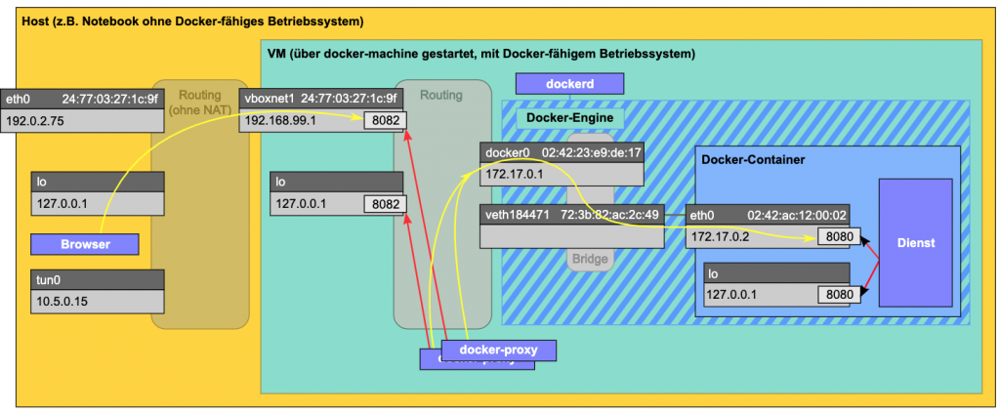

# Docker Binary & Process
## 개요
- Docker를 호스트 서버에 설치했을 때, /bin 디렉토리 아래에는 다음과 같은 파일들이 존재한다.

```bash
[root@m-k8s bin]# ls -al *docker*
-rwxr-xr-x. 1 root root 75496208 Sep  5  2019 docker
lrwxrwxrwx. 1 root root       25 Sep  1 10:28 dockerd -> /etc/alternatives/dockerd
-rwxr-xr-x. 1 root root 90950736 Sep  5  2019 dockerd-ce
-rwxr-xr-x. 1 root root   845008 Sep  5  2019 docker-init
-rwxr-xr-x. 1 root root  2899336 Sep  5  2019 docker-proxy
[root@m-k8s bin]# ls -al *container*
-rwxr-xr-x. 1 root root 49288416 Jun 13  2019 containerd
-rwxr-xr-x. 1 root root  5759680 Jun 13  2019 containerd-shim
```

- 하나씩 살펴보도록 하자.

## docker
- docker 파일은 CLI(Command Line Interface)를 수행하기 위한 binary 이다.
  - 즉, 사용자가 docker engine으로 다양한 명령을 요청할 때 사용하는 프로그램이다.
- docker CLI 를 통해 수행된 명령은 REST API wrapper 를 통해 docker daemon 에 전달된다.
- docker client 와 server(docker daemon) 간 통신 방식은 기본적으로 unix domain socket(IPC socket)을 사용하며, 이외에도 fd 또는 tcp를 사용할 수 있다.
  - unix domain socket 방식을 이용할 경우에는 내부적으로 /var/run/docker.sock 파일을 사용하여 통신한다.
  - fd 방식은 systemd base인 system 에서만 사용할 수 있는데, 이는 Systemd socket activation 이라는 기능을 이용한다.
  - remote 에서 접속을 해야할 경우에는 tcp 를 사용해야 하고 docker 를 통해 다음과 같이 접속한다.

```bash
$ docker -H tcp://0.0.0.0:2375 ps
$ docker -H tcp://192.168.0.131:2375 ps
$ export DOCKER_HOST="tcp://0.0.0.0:2375"
$ docker ps
```
- docker 18.09 버전부터는 아래와 같이 ssh 를 이용하여 docker daemon 에 접속할 수 있게 되었다.

```bash
$ docker -H ssh://me@example.com:22 ps
$ docker -H ssh://me@example.com ps
$ docker -H ssh://example.com ps
```

- 위와 같이 docker(client)는 unix domain socket, fd, tcp 방식으로 docker daemon 에 접속하고, docker daemon(server)은 자신이 command 를 수신할 통신 방식을 지정하여 기동해둔다.
  - 즉, 가능한 통신 방식은 docker daemon 이 어떤 방식으로 listen 을 하고 있느냐에 따라 달라질 수 있다.
  - -H 옵션을 통해 listen 방식을 multiple로 지정할 수 있다.

```bash
# systemd socket activation 기능을 이용하여 local 에서만 접속 가능
$ dockerd -H fd://

# unix domain socket과 2개의 tcp ip를 listen 하도록 기동
$ dockerd -H unix:///var/run/docker.sock -H tcp://192.168.59.106 -H tcp://10.10.10.2
```

## docker-init
- docker run 수행 시 --init 옵션이 주어지지 않을 경우는 container 내에서 init process 를 별도로 기동하지 않는다.
  - docker run 수행 시 넘겨준 command(/bin/bash)가 그대로 1 번 process가 된다.
- 반대로 docker run 수행 시 --init 옵션이 주어질 경우, init process를 container 구동 후 1번 process로 기동하게 된다.
  - container 내에서 init process 를 1번으로 구동한다는 것은 중요한 의미가 있다.
  - 이는 child process를 받아주어 resource 의 누수나 zombie process의 생성 등을 방지하는 init system의 역할을 container 내에서 수행한다는 뜻이기 때문이다.
- init process로 사용되는 default binary는 /bin/docker-init를 사용한다.
  - docker-init 은 container 외부에서 별도로 기동되거나 하는 process가 아니다.
  - container 내에서 첫 번째로 기동되어 마치 Host에서의 init process 처럼 동작하도록 만들어진 프로그램이라고 생각하면 된다.

## docker-proxy
- container 를 기동할 때 -p 8080:80 옵션을 주면 Host의 8080 port로 들어오는 요청을 container의 80 port로 전달해준다.
```bash
$ docker run -d -p 8080:80 --name web_svr01 httpd
```
- docker ps를 통해 기동된 container 상태를 보면 PORTS 항목에서 이를 확인할 수 있다.
- tcp를 이해한다면 이러한 port 변환을 누군가 중간에서 수행해주어야 한다는 것을 짐작할 수 있다.
  - client가 tcp를 통해 ip/port 정보로 server에게 연결을 수행하면, 이 때부터는 해당 연결을 시스템이 ip:port라는 키를 통해 관리하게 된다.
  - tcp 연결이 완료된 후 port를 변경할 수는 없다.
  - 이는 외부의 client가 container로 8080 port로 연결한 후 80으로 바꾸는 것은 불가능하다는 것이다.
- 따라서, 중간의 누군가가 외부 client의 연결을 tcp 8080 port로 받아주고, 내부적으로 container와의 정해진 통신 방식으로 data를 container의 80 port로 forwarding 해주어야 한다.
  - 이 역할을 담당하는 것이 'docker-proxy' 이다.
- docker를 기동할 때 위와 같이 -p 옵션을 통해 특정 port를 외부로 publish 하지 않으면 docker-proxy는 불필요하다. (기동되지도 않는다.)
  - docker host 내부의 container 간의 통신은 docker0 라는 bridge를 통해 기본적으로 가능하기 때문이다.

<p align="center"></p>

- 즉, 외부와 docker-proxy 사이의 통신은 8080/tcp를 사용하고, docker-proxy 와 container 간의 통신은 docker0 라는 내부 bridge를 사용하게 된다.

### 8082 에서 8080으로 forwarding 하는 예시
<p align="center"></p>

- 외부 Browser에서 들어온 요청이 8082 port로 listen 하고 있는 docker-proxy로 먼저 전달된다.
  - 이는 내부의 docker0(172.17.0.1) -> veth184471 -> eth0(172.17.0.2) 8080 의 과정을 통해 container 로 전달 됨을 확인할 수 있다.
- docker-proxy 가 없다면 Browser 와 docker0 의 중간에 연결 매개체가 없으므로, container 의 8080 port로는 외부와 통신을 수행할 수 없다.

### docker run -p 를 통해 다수의 container를 기동할 때 외부 노출 port를 동일하게 줄 수 있을까?
```bash
$ docker run -d -p 8080:80 --name web_svr01 httpd
$ docker run -d -p 8080:90 --name web_svr02 httpd
```

- 당연히 안 된다.
- 위와 같이 container를 구동하게 되면 동일한 8080 port에 대해 2개의 docker-proxy가 binding 하려 할 것이다.
  - 두 개의 프로세스가 동일한 tcp port 에 대해 binding 하는 것은 시스템에서 허용하지 않는다.
  - 물론 port 는 같더라도 다른 ethernet interface, 즉 다른 ip 를 이용하여 bind 하는 것은 가능하다.

---
- docker run -d -p 8080:80 --name web_svr01 httpd 명령을 통해 container를 실행하면, 아래와 같이 docker-proxy process가 기동되는 것을 Host 에서 확인할 수 있다.

```bash
[root@m-k8s bin]# ps -ef | grep docker-proxy | grep -v grep
root     30654  1002  0 19:06 ?        00:00:00 /usr/bin/docker-proxy -proto tcp -host-ip 0.0.0.0 -host-port 8080 -container-ip 172.17.0.2 -container-port 80
```

- 그리고, docker-proxy process는 8080 port를 통해 listen 중이다.


## dockerd, containerd
- dockerd 와 containerd는 서로 밀접하게 관련되어 있어 묶어서 함께 살펴보도록 하자.
- dockerd : volume, image, networking 관리 뿐 아니라 orchestration 까지 관장하여 처리한다. client로부터 REST API 형식의 요청을 수신하여 처리한다.
- containerd : container의 lifecycle을 관리한다. client로부터의 container 관리 관련 요청은 dockerd를 거쳐 gRPC 통신을 통해 containerd로 전달된다.
<p align="center"></p>

- docker service를 맨 처음 시작하면 기동되는 daemon process는 어떤 것이 있을까?
  - 일단 현재 떠 있는 docker, container service를 모두 중지시켜보자.
```bash
$ systemctl stop docker.service
$ systemctl stop containerd.service
```
- 이제 docker service를 올려보자.

```bash
root     24087     1  1 20:27 ?        00:00:00 /usr/bin/containerd
root     24088     1  9 20:27 ?        00:00:01 /usr/bin/dockerd -H fd:// --containerd=/run/containerd/containerd.sock
```

- 기본적으로 구동되는 daemon process는 dockerd와 containerd 두 개이다.
  - 이 둘을 합쳐서 docker engine 이라고 부른다.
- docker.service 를 start 하면 docker daemon 이 자동으로 containerd 까지 기동해준다.
- containerd 를 별도로 사용자가 manual 하게 기동할 수도 있다.
  - 하지만, 이 때는 dockerd 에게 containerd 와의 통신을 위한 socket path 를 알려주어야 한다.
  - dockerd 를 기동할 때 아래와 같이 path를 넘겨준다.

```bash
$ dockerd --containerd /run/containerd/containerd.sock
```

- 예전에는 containerd가 지금처럼 별도로 분리된 component 가 아니었는데, 점차 docker component와 container component는 완전히 분리되어 별도의 솔루션으로 관리되는 듯 하다.
  - 이렇게 분리되어 있으면 docker를 upgrade 하거나 문제가 생겼을 때에도 container에 영향을 주지 않도록 할 수 있다.

## containerd-shim, runc
- Docker 관련 binary 중 마지막으로 containerd-shim과 runc 라는 파일이 존재한다.
  - 맨 위쪽의 binary 화면 캡처에서 runc 는 누락되어 있는데 /bin 아래에는 runc 도 존재한다.
- 이 파일들이 왜 필요한지를 이해하기 위해 먼저 container runtime 에 대해 알아야 한다.

### container runtime
- docker daemon의 기능 중 container의 lifecycle을 관리하는 기능들은 containerd가 담당했었다.
- container란 무엇인가? '격리 및 리소스 관리 기술이 적용된 프로세스'이다.
  - 이러한 격리 환경을 제공하기 위해 내부적으로 cgroup과 namespace 등의 Linux kernel 기술이 사용된다.
  - 즉, cgroup이나 namespace 등의 기술을 container를 실행할 때 사용하는 것이다.
- 그런데, 이러한 cgroup 과 namespace 등을 다루는 방법(Interface)은 시스템마다 다르지 않을까?
  - 그리고, Linux kernel 버전에 따라 계속 변하지 않을까?
  - 그렇다면 Docker는 어떻게 대처해야 할까에 대한 고민이 Docker engine 개발자들에게 생길 수 밖에 없었을 것 같다.

<p align="center"></p>

- 과거에 Docker는 이러한 기술들을 사용하기 위해 LXC(Linux Container)나 libvirt 같은 중간 매개체(driver, library)를 통해 간접적으로 control 하였다.
  - 즉, kernel의 가상화 관련 기술들을 간접적으로 사용한 것이다.
- Kernel 관련 가상화 기술들이 Docker 의 발전에 꼭 필요한 요소인데, 이를 다루는 인터페이스는 LXC 나 libvirt 같은 외부 솔루션에 의존하는 것이 문제였다.
  - 따라서 어느 순간부터 Docker 진영에서 kernel의 가상화 기술을 다루기 위한 interface를 자체적으로 개발, 관리해야 한다는 필요성이 생겼는데,
  - 이 때문에 개발된 것이 'libcontainer' 이다.
  - kernel의 가상화 관련 기술들을 직접적으로 다룰 수 있는 자체 구현체를 가지게 된 것이다.
- 그리고, Docker version 1.11 이후 libcontainer는 또 한번 refactoring 과정을 거치게 되는데, 이것이 바로 현재 'runC' 라고 불리는 container runtime이다.
  - runC는 system에서 container 관련 기능들에 대해 docker가 쉽게 사용할 수 있도록 해주는 가볍고 이식 가능한 container runtime 이다.

#### OCI(Open Container Initiative)
- 기억해야할 것은 system의 container 관련 기술을 다루는 interface도 표준화되어 있다는 것인데, 그 표준을 OCI라고 한다.
- 정리하자면 다음과 같다.
  - containerd 는 container의 관리를 위해 runC를 사용하는데,
  - runC는 kernel의 container 관련 기술을 다루기 위해 OCI spec을 준수하고 있다고 이해하면 되겠다.

## 정리
- 그렇다면 container를 하나 실행하는 과정을 통해 containerd, containerd-shim, runc binary가 어떻게 사용되는지를 정리해보자.
  - 사용자가 docker run을 통해 container 기동을 요청하면 다음의 과정으로 처리된다.

```
1) dockerd는 요청을 gRPC를 통해 containerd로 전달한다.
2) containerd 는 exec을 통해 containerd-shim을 자식으로 생성한다.
3) containerd-shim 은 runc를 이용하여 container를 생성한다.
  - runc는 container가 정상적으로 실행되면 exit 한다.
4) containerd-shim 은 그대로 살아있으며, 이는 container 내에서 실행되는 process 들의 부모가 된다.
```

### containerd-shim 이 필요한 이유
- daemonless container를 위해서다.
  - 즉, container 하나 뜬다고 해서 뭔가 계속 수행되는 runtime daemon이 존재할 필요가 없다. (runc는 이미 exit 했다.)
  - containerd-shim 의 경우는 껍데기나 마찬가지다.
- container를 위한 STDIO 및 fd 를 계속 유지해준다.
  - dockerd 와 containerd가 둘 다 죽게 되는 상황이 되면 pipe의 한쪽이 닫혀서 container까지 죽을 수 있는데 이를 막아준다.
  - 즉, docker daemon 들의 장애 상황이 container까지 전파되지 않도록 해준다.
  - 이는 container에게 영향을 주지 않고 docker engine의 upgrade 작업도 수행할 수 있게 해준다.
- container의 exit status 등을 higher level tool로 보고할 수 있다.
  - containerd-shim -> runc -> container 인 상황에서 runc 는 exit 하게 되므로 container의 parent는 containerd-shim 이 된다.
  - 따라서, containerd-shim 은 자식의 상태를 파악하고 이를 어딘가로 보고하는 구조가 된다.


### 그림으로 정리

<p align="center"></p>

<p align="center"></p>


