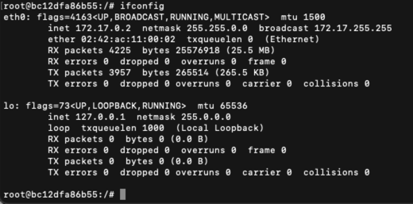
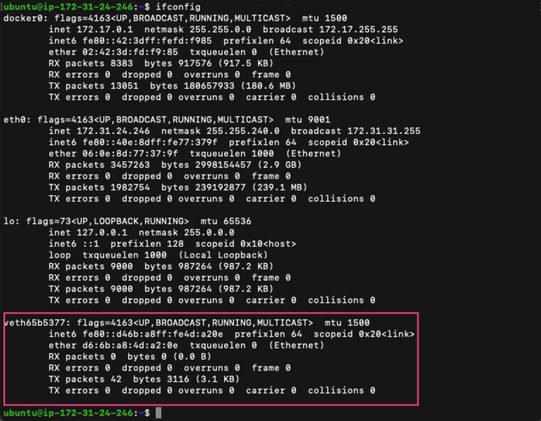
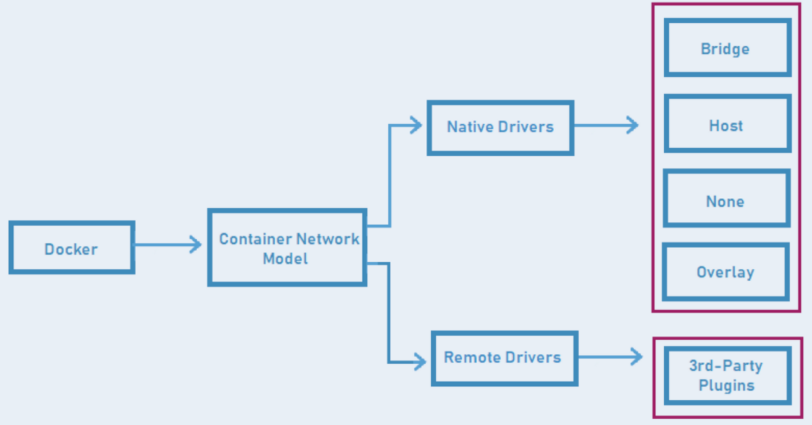
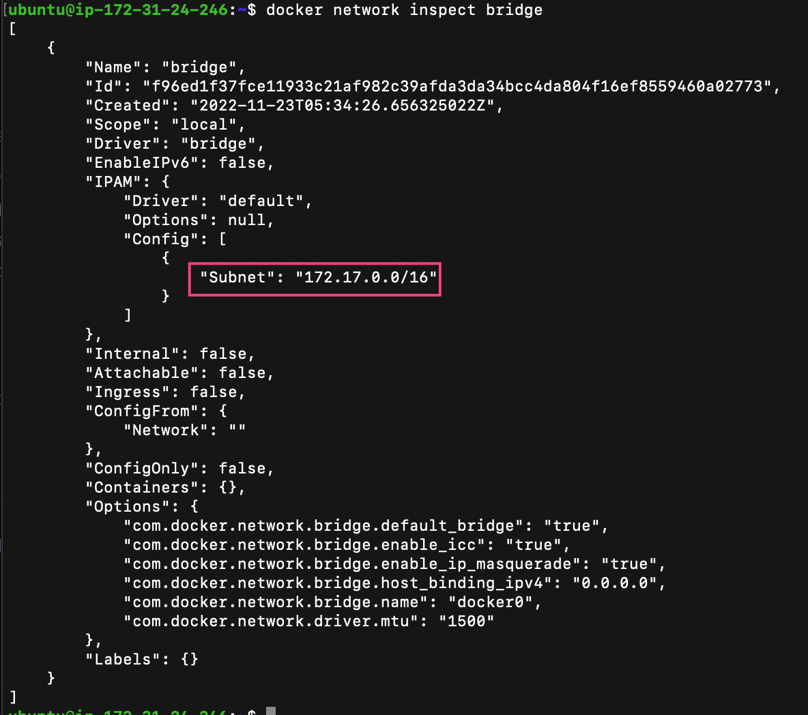
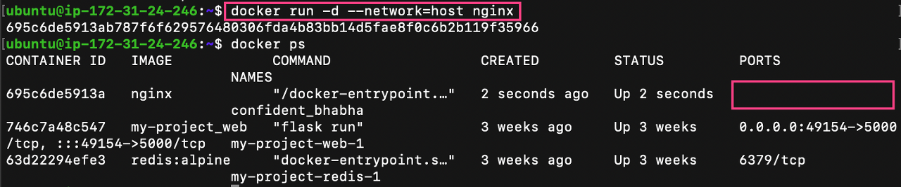

# 도커 네트워크
## 도커 네트워크 구조
<p align="center"></p>

- 기본적으로 도커를 호스트 운영체제에 설치하면 여러가지 네트워크 드라이버들이 설치되며, IP 주소를 순차적으로 할당하고 도커 컨테이너를 실행할 때 사용하고 싶은 네트워크 드라이버를 선택할 수 있다.
- 도커는 컨테이너에 172.17.0.x의 IP를 순차적으로 할당한다. 

```bash
$ docker run -it ubuntu:focal
```

- 컨테이너 내부에서 ifconfig 명령어를 통해 컨테이너의 네트워크 인터페이스를 확인해보자.

<p align="center"></p>

- 위의 결과를 보면 lo 네트워크 인터페이스와 eth0 네트워크 인터페이스가 각각 172.17.0.1과 172.17.0.2가 할당된 것을 확인할 수 있다.
- 해당 IP들은 내부 IP 이므로 아무런 설정을 하지 않았다면 이 컨테이너는 외부에서 접근할 수 없으며 도커가 설치된 호스트 내부에서만 접근할 수 있다.
  - 외부에 컨테이너 어플리케이션을 노출하기 위해서는 eth0의 IP 포트를 호스트의 IP와 포트에 바인딩해야 한다.
- 외부와의 네트워크 연결은 컨테이너마다 eth0 에 대응되는 veth 라는 가상 네트워크 인터페이스를 호스트에 생성함으로써 이루어진다.
  - 그리고 각각의 IP 주소와 포트를 입력해 컨테이너를 외부에 노출시킬 수 있다.
  - veth는 도커 호스트에서 ifconfig 명령어를 통해 확인 가능하다.

<p align="center"></p>

- 즉, eth0에 대응되는 vethXXXX이라는 이름의 veth interface와 브릿지 네트워크에 컨테이너의 interface가 바인딩되는 형태로 통신한다. 
- veth 인터페이스는 사용자가 직접 생성할 필요는 없고 컨테이너가 생성될 때 도커 엔진이 자동으로 생성한다.
  - 도커 컨테이너가 실행될 때 네트워크 드라이버를 따로 지정하지 않으면 docker0 라고 하는 브릿지 네트워크를 default로 사용한다.
  - 해당 브릿지 네트워크의 역할은 veth와 호스트 eth0의 다리 역할을 한다.

### veth란?
- 리눅스의 virtual ethernet interface, virtual eth를 의미한다.
  - 랜카드에 연결된 실제 네트워크 인터페이스가 아니라 가상으로 생성한 네트워크 인터페이스이다.
- 일반적인 네트워크 인터페이스와는 달리 패킷을 전달받으면, 자신에게 연결된 다른 네트워크 인터페이스로 패킷을 보내주는 식으로 동작하기 때문에 항상 쌍(pair)로 생성해주어야 한다.
  - 한 쪽에서 다른 쪽으로 패킷을 전송할 수 있으며, 한 쪽이 다운된 경우 나머지 한 쪽도 정상적으로 기능하지 않는 것이 특징이다.
  - 도커에서는 실행중인 컨테이너 수만큼 veth로 시작하는 인터페이스가 생성된다.

## 도커 네트워크 드라이버
### 도커 네트워크 종류
<p align="center"></p>

- 도커 네트워크 드라이버는 Native 드라이버와 Remote 드라이버로 나뉜다.
  - Native Drivers : Bridge, Host, None, Overlay를 사용.
  - Remote Drivers : 써드파티 드라이버로 외부에서 잘 만들어진 드라이버를 사용.

### 네트워크 동작 방식에 따라 드라이버 분류
- 네트워크 드라이버는 단일 호스트에서 동작하는 네트워킹, 다중 호스트에서 동작하는 네트워킹이 있다.
  - 단일 호스트 네트워크 드라이버 -> Bridge, Host, None 네트워크
  - 다중 호스트 네트워크 드라이버 -> Overlay 네트워크

### 도커 네트워크 목록 확인
- 도커 네트워크 목록은 docker netork ls 명령어로 확인 가능하다.

```bash
$ docker network ls
```

### 도커 네트워크 확인하기
```bash
$ docker network insepct [NETWORK ID or NAME]
```
- 도커 네트워크는 docker network inspect 명령어로 확인 가능하다.

### 도커 네트워크 생성하기
- 도커 네트워크는 docker network create 명령어로 생성할 수 있고, --driver 옵션으로 네트워크 드라이버를 지정할 수 있다.

```bash
# ex. docker network create --driver=bridge seunghwan-bridge
$ docker network create --driver=[NETWORK DRIVER] [DRIVER NAME]
```

### 네트워크 지정 후 컨테이너 실행
- 도커 네트워크는 docker run 명령어에 --network 옵션으로 네트워크를 지정할 수 있다.

$ docker run -d --network=[NETWORK DRIVER] [CONTAINER NAME]

### Bridge 네트워크
- 포트를 연결해 Port를 외부에 노출하는 방식이 이 bridge 네트워크를 이용하는 방식이다.
- 위의 예제에서도 네트워크 드라이버를 지정해주지 않았으므로 default로 docker0 라는 bridge 네트워크를 사용하고 있다.
  - 그리고, 커스텀 bridge 네트워크를 생성해서 사용할 수도 있다.
- bridge 네트워크를 확인해보면 docker0 브릿지 네트워크인 것을 확인할 수 있다.
  - IP 172.17.0.0을 사용하는 것을 확인할 수 있고 컨테이너를 네트워크 드라이버를 지정하지 않고 생성하면 해당 docker0 브릿지 네트워크를 사용한다.

<p align="center"></p>

### Host 네트워크
- host 네트워크는 도커가 제공해주는 가상 네트워크(veth)를 사용하는 것이 아니라 직접 host 네트워크에 붙어서 사용하는 개념이다.
- 그래서 host 네트워크를 사용할 경우에는 Port 바인딩을 하지 않더라도 host 네트워크를 사용하기 때문에 접속을 할 수 있게 된다.

```bash
$ docker run -d --network=host nginx
```

- 위 명령어로 호스트 네트워크 드라이버로 nginx를 실행시키면 포트 목록이 보이지 않는 것을 확인할 수 있다.

<p align="center"></p>

### None 네트워크 
- none 네트워크 드라이버는 해당 컨테이너가 네트워크 기능이 필요없을 때, 혹은 커스텀 네트워킹을 사용해야 하는 경우가 있을 때 드라이버를 none으로 설정하고 사용할 수 있다. 
- none 네트워크를 사용해서 컨테이너를 생성하면 외부와의 연결이 단절된다.

```bash
$ docker run --network none ubuntu:focal
```
