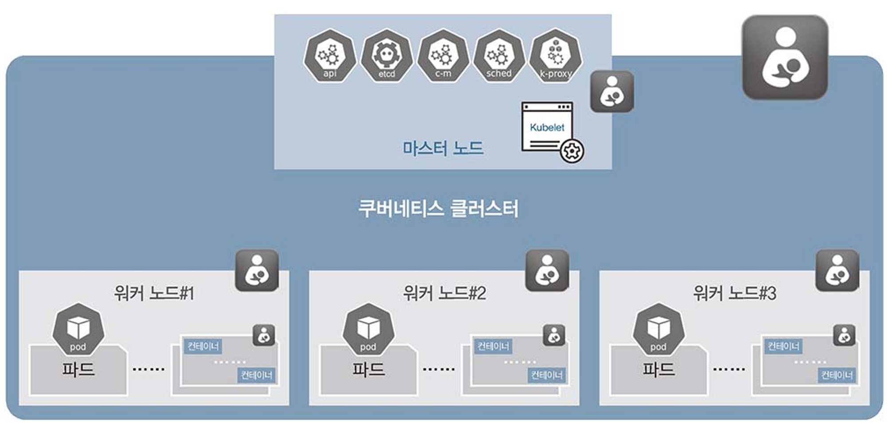
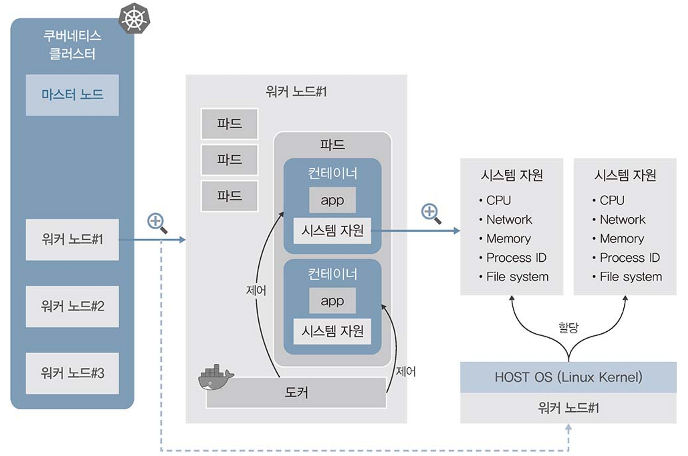

# 파드, 컨테이너, 도커, 쿠버네티스
## 쿠버네티스 시스템

- 파드는 쿠버네티스로부터 IP를 받아 컨테이너가 외부와 통신할 수 있는 경로를 제공한다.
- 컨테이너들이 정상적으로 작동하는지 확인하고 네트워크나 저장 공간을 서로 공유하게 한다.
- 파드가 이런 환경을 제공하므로 컨테이너들은 마치 하나의 호스트에 존재하는 것처럼 작동할 수 있다.

- 컨테이너를 돌보는 것이 파드, 파드를 돌보는 것이 워커 노드, 워커 노드를 돌보는 것이 쿠버네티스 마스터이다. (쿠버네티스 마스터 또한 파드(컨테이너)로 이루어짐)
- 

