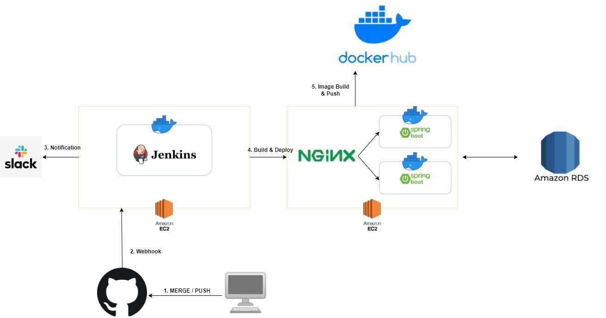
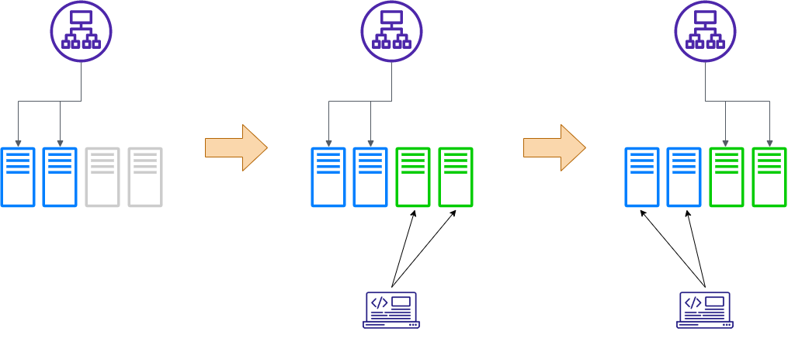

# 블루그린 배포 전략
## 개요
- 쿠버네티스에서 애플리케이션을 배포하는 일은 어렵지 않다. 그러나, 파드의 특성상 배포되는 애플리케이션의 변경이 있다면 삭제 후 생성의 과정을 거친다.
- 따라서, 중요한 서비스가 동작하는 경우 중단되는 시간이 큰 부담일 수 있다.
- 변경된 애플리케이션을 중단 없이 배포하는 방법인 블루그린 전략을 젠킨스상에서 구현하는 것을 진행한다.

## 배포 흐름
<p align="center"></p>

## 롤링 업데이트
- 롤링 업데이트란 새 버전을 배포하면서, 새 버전 인스턴스를 하나씩 늘려가고 기존 버전의 인스턴스를 하나식 줄여나가는 방식
- 이러한 경우 새 버전의 인스턴스로 트래픽이 이전되기 전까지 이전 버전과 새 버전의 인스턴스가 동시에 존재할 수 있다는 단점이 있지만, 시스템을 무중단으로 업데이트 할 수 있다는 장점이 있다.

### 쿠버네티스에서 Replica Set(RS)을 이용하는 방법
1. 예시의 상황으로, RS가 v1 버전의 파드들을 관리하고 3개의 파드가 서비스된다고 가정하자.
2. 이 때, v2 버전의 pod 3개를 배포해야 하는 상황이 생긴다.
3. 이에 따라 2 파드를 컨트롤할 RS를 만들고 replica를 1로 해서 v2 Pod를 하나 생성한다. 그리고 RS v1에서는 replica의 수를 3에서 2로 줄이고 v1 파드의 수를 2개로 조정한다.
4. 같은 방식으로 v1의 파드는 수를 줄이면서 v2의 파드는 수를 늘린다. 최종적으로 v1의 파드는 0개가 되고 RC v1은 삭제된다.

### 문제점
- 롤링 업데이트 배포 과정에서 내부 파드 개수가 많다면 업데이트 과정이 길어진다.
- 따라서, 두 가지의 버전이 오래도록 공존하는 경우가 발생한다.
- 이를 방지하기 위한 방법 중 하나가 블루그린 배포 전략이다.

## 블루그린 배포 전략 
> 모든 파드가 업데이트된 이후에 트래픽을 전달하자.
<p align="center"></p>

- 2개의 디플로이먼트를 생성하고 기존에 배포된 디플로이먼트(블루)로 계속 트래픽을 전달한다.
- 새로 배포되는 디플로이먼트(그린)에 모든 파드가 업데이트돼 트래픽을 처리하는데 문제가 없을 때 서비스를 그린으로 넘긴다. (기존의 블루 디플로이먼트 삭제)
- 그러나, 배포를 위한 디플로이먼트를 만들어야 하므로 기존 디플로이먼트 배포 대비 최소 2배 이상의 리소스를 요구한다는 것이 단점이다.

## 실습

### 1) Pipeline 아이템 생성
- 이름은 dpy-pl-blue-green으로 지정한다.

### 2) Definition 파트에서 설정
- SCM을 git으로 설정하고 Repository URL 설정
- Branch Specifier 또한 */main 지정

### 3) Jenkinsfile 소스 해석
- D-3 파일 참조.

### 4) 첫 번째 배포 (Build Now 진행)
- 블루그린 대시보드를 배포하고 배포 완료된 것을 확인

### 5) 대시보드 디플로이먼트와 서비스가 정상 배포 및 할당되었는지 확인
```bash
[root@m-k8s ~]# kubectl get deployment,service --selector=app=dashboard
NAME                      READY   UP-TO-DATE   AVAILABLE   AGE
deployment.apps/pl-blue   3/3     3            3           27m

NAME                        TYPE           CLUSTER-IP      EXTERNAL-IP    PORT(S)        AGE
service/pl-blue-green-svc   LoadBalancer   10.107.134.42   192.168.1.12   80:32310/TCP   26m
```
- 웹 브라우저로 192.168.1.12에 접속했을 때 blue color의 화면 확인 가능

### 6) 두 번째 배포
- 블루그린 배포는 모든 배포가 완료되는 순간 새롭게 배포한 대시보드로 전환한다.
- 이를 확인하기 위해 kubectl get deployments --selector=app=dashboard -w를 실행해 놓고, 젠킨스 화면으로 이동해 두 번째 배포를 진행한다.
```bash
[root@m-k8s ~]# kubectl get deployments --selector=app=dashboard -w
NAME      READY   UP-TO-DATE   AVAILABLE   AGE
pl-blue   3/3     3            3           30m
```

### 7) 재확인
- 배포 이후 완료되기 전까지는 웹 브라우저는 blue color로 변화 없음


