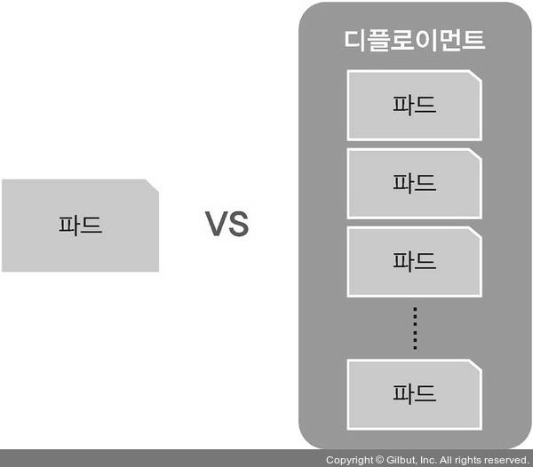

# 파드(Pod)
## 파드 생성
> 쿠버네티스의 사용 = 사용자에게 효과적으로 파드 제공

### run 방식
```bash
[root@m-k8s ~]# kubectl run nginx-pod --image=nginx
pod/nginx-pod created
```
- run 다음에 나오는 nginx는 파드의 이름이고, --image=nginx는 생성할 이미지의 이름이다.

### create 방식
```bash
[root@m-k8s ~]# kubectl create nginx --image=nginx
Error: unknown flag: --image
See 'kubectl create --help' for usage.
```

- --image라는 옵션이 없다는 에러 메시지가 나오고 파드는 생성되지 않는다.
- create로 파드를 생성하기 위해서는 kubectl create에 deployment를 추가해서 실행해야 한다.

```bash
[root@m-k8s ~]# kubectl create deployment dpy-nginx --image=nginx
deployment.apps/dpy-nginx created
```

### run과 create 방식의 비교
``` bash
[root@m-k8s ~]# kubectl get pods -o wide
NAME                       READY   STATUS    RESTARTS   AGE     IP               NODE     NOMINATED NODE   READINESS GATES
dpy-nginx-c8d778df-vjkdg   1/1     Running   0          78s     172.16.103.129   w2-k8s   <none>           <none>
nginx-pod                  1/1     Running   0          4m43s   172.16.221.129   w1-k8s   <none>           <none>
```

- 위의 파드의 ip에서 curl 명령을 실행해 웹페이지 정보를 받아오자.

``` bash
[root@m-k8s ~]# curl 172.16.103.129
<!DOCTYPE html>
<html>
<head>
<title>Welcome to nginx!</title>
[생략]
```

``` bash
[root@m-k8s ~]# curl 172.16.221.129
<!DOCTYPE html>
<html>
<head>
<title>Welcome to nginx!</title>
[생략]
```

- 웹페이지 정보는 동일하게 받아올 수 있다.

<p align="center"></p>
- run으로 파드를 생성하면 단일 파드 1개만 생성되고 관리된다.
- create deployment로 파드를 생성하면 디플로이먼트라는 관리 그룹 내에서 파드가 생성된다.

