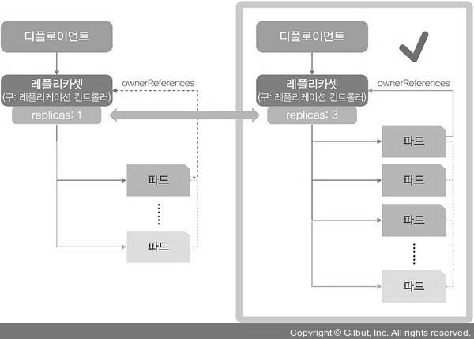
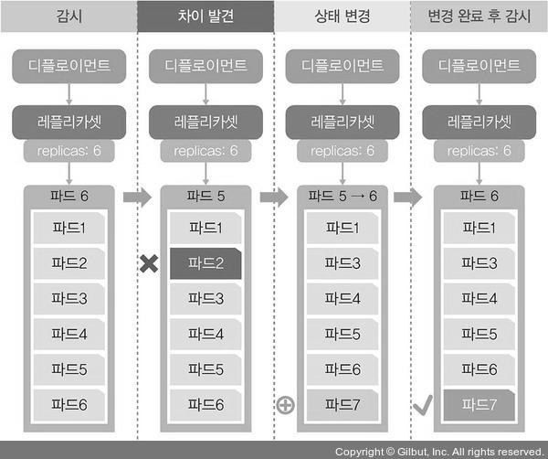

# 파드(Pod)
## 파드 생성
> 쿠버네티스의 사용 = 사용자에게 효과적으로 파드 제공

### run 방식
```bash
[root@m-k8s ~]# kubectl run nginx-pod --image=nginx
pod/nginx-pod created
```
- run 다음에 나오는 nginx는 파드의 이름이고, --image=nginx는 생성할 이미지의 이름이다.

### create 방식
```bash
[root@m-k8s ~]# kubectl create nginx --image=nginx
Error: unknown flag: --image
See 'kubectl create --help' for usage.
```

- --image라는 옵션이 없다는 에러 메시지가 나오고 파드는 생성되지 않는다.
- create로 파드를 생성하기 위해서는 kubectl create에 deployment를 추가해서 실행해야 한다.

```bash
[root@m-k8s ~]# kubectl create deployment dpy-nginx --image=nginx
deployment.apps/dpy-nginx created
```

### run과 create 방식의 비교
``` bash
[root@m-k8s ~]# kubectl get pods -o wide
NAME                       READY   STATUS    RESTARTS   AGE     IP               NODE     NOMINATED NODE   READINESS GATES
dpy-nginx-c8d778df-vjkdg   1/1     Running   0          78s     172.16.103.129   w2-k8s   <none>           <none>
nginx-pod                  1/1     Running   0          4m43s   172.16.221.129   w1-k8s   <none>           <none>
```

- 위의 파드의 ip에서 curl 명령을 실행해 웹페이지 정보를 받아오자.

``` bash
[root@m-k8s ~]# curl 172.16.103.129
<!DOCTYPE html>
<html>
<head>
<title>Welcome to nginx!</title>
[생략]
```

``` bash
[root@m-k8s ~]# curl 172.16.221.129
<!DOCTYPE html>
<html>
<head>
<title>Welcome to nginx!</title>
[생략]
```

- 웹페이지 정보는 동일하게 받아올 수 있다.

<p align="center"></p>

- run으로 파드를 생성하면 단일 파드 1개만 생성되고 관리된다.
- create deployment로 파드를 생성하면 디플로이먼트라는 관리 그룹 내에서 파드가 생성된다.


## 레플리카셋으로 파드 수 관리
> 많은 사용자를 대상으로 웹 서비스를 하기 위해 다수의 파드 필요, 따라서 쿠버네티스는 다수의 파드를 만드는 레플리카셋 오브젝트를 제공한다.

<p align="center"></p>

### 1번
``` bash
[root@m-k8s ~]# kubectl get pods
NAME                       READY   STATUS    RESTARTS   AGE
dpy-nginx-c8d778df-vjkdg   1/1     Running   0          13m
nginx-pod                  1/1     Running   0          16m
```
- 배포된 파드의 상태를 확인한다.

### 2번
``` bash
[root@m-k8s ~]# kubectl scale pod nginx-pod --replicas=3
Error from server (NotFound): the server could not find the requested resource
```
- nginx-pod를 scale 명령에 --replicas=3 이라는 파드의 수를 3개로 맞추는 옵션을 사용한다.
- nginx-pod는 run 명령어로 단일 파드로 생성되었기 때문에 디플로이먼트 오브젝트에 속하지 않으므로 리소스를 확인할 수 없다는 에러가 발생한다.

### 3번
``` bash
[root@m-k8s ~]# kubectl scale deployment dpy-nginx --replicas=3
deployment.apps/dpy-nginx scaled
```
- dpy-nginx의 파드의 수를 3개로 만든다.

### 4번
```bash
[root@m-k8s ~]# kubectl get pods -o wide
NAME                       READY   STATUS    RESTARTS   AGE   IP               NODE     NOMINATED NODE   READINESS GATES
dpy-nginx-c8d778df-56wrc   1/1     Running   0          64s   172.16.221.130   w1-k8s   <none>           <none>
dpy-nginx-c8d778df-7hk9r   1/1     Running   0          64s   172.16.132.1     w3-k8s   <none>           <none>
dpy-nginx-c8d778df-vjkdg   1/1     Running   0          18m   172.16.103.129   w2-k8s   <none>           <none>
nginx-pod                  1/1     Running   0          21m   172.16.221.129   w1-k8s   <none>           <none>
```

- AGE 열에서 볼 수 있듯 2개의 nginx 파드는 새로 생성되었음을 확인할 수 있다.
- dpy-nginx의 모든 파드가 정상적으로 워커 노드에 적용되고 IP가 부여되었다.

### 5번
```bash
[root@m-k8s ~]# kubectl delete deployment dpy-nginx
deployment.apps "dpy-nginx" deleted
```
- dpy-nginx를 삭제한다.


## 파드의 컨테이너 자동 복구 (셀프 힐링, Self-Healing)
> 제대로 작동하지 않는 컨테이너를 다시 시작하거나 교체해 파드가 정상적으로 작동하게 한다.

### 1번
```bash
[root@m-k8s ~]# kubectl get pods -o wide
NAME                        READY   STATUS    RESTARTS   AGE     IP               NODE     NOMINATED NODE   READINESS GATES
echo-hname-7894b67f-cfpkt   1/1     Running   0          3m10s   172.16.103.130   w2-k8s   <none>           <none>
echo-hname-7894b67f-dljf4   1/1     Running   0          48s     172.16.221.132   w1-k8s   <none>           <none>
echo-hname-7894b67f-hkx9b   1/1     Running   0          48s     172.16.103.131   w2-k8s   <none>           <none>
echo-hname-7894b67f-hr69k   1/1     Running   0          48s     172.16.132.3     w3-k8s   <none>           <none>
echo-hname-7894b67f-mtrmq   1/1     Running   0          3m10s   172.16.221.131   w1-k8s   <none>           <none>
echo-hname-7894b67f-wpk2s   1/1     Running   0          3m10s   172.16.132.2     w3-k8s   <none>           <none>
nginx-pod                   1/1     Running   0          64m     172.16.221.129   w1-k8s   <none>           <none>
```
- 파드에 접속하기 위해 파드의 IP를 파악한다.

### 2번
```bash
[root@m-k8s ~]# kubectl exec -it nginx-pod -- /bin/bash
root@nginx-pod:/#
```
- kubectl exec 명령을 실행해 파드 컨테이너의 shell에 접속한다.
- i 옵션은 stdin(표준 입력)이고, t는 tty(명령줄 인터페이스)를 뜻한다. 이 둘을 합친 -it는 표준 입력을 명령줄 인터페이스로 작성한다는 의미이다.
- nginx-pod에 /bin/bash를 실행해 nginx-pod의 컨테이너에서 bash shell에 접속한다.

### 3번
```bash
root@nginx-pod:/# cat /run/nginx.pid
1
```

- 컨테이너에서 구동하는 nginx의 PID를 확인한다. 이 때, nginx의 PID는 언제나 1이다. (이유 확인)

### 4번

```bash
[root@m-k8s ~]# i=1; while true; do sleep 1; echo $((i++)) `curl --silent 172.16.221.129 | grep title` ; done
```
- nginx-pod의 IP에서 돌아가는 웹 페이지를 1초마다 한 번씩 요청하는 스크립트를 실행한다.
- curl에서 요청한 값만 받도록 --silent 옵션을 추가한다.

### 5번
```bash
root@nginx-pod:/# kill 1
root@nginx-pod:/# command terminated with exit code 137
```
- bash shell 에서 nginx 프로세서인 PID 1번을 종료시킨다.

### 6번
```bash
1 <title>Welcome to nginx!</title>
2 <title>Welcome to nginx!</title>
3 <title>Welcome to nginx!</title>
4 <title>Welcome to nginx!</title>
5 <title>Welcome to nginx!</title>
6 <title>Welcome to nginx!</title>
7 <title>Welcome to nginx!</title>
8 <title>Welcome to nginx!</title>
9 <title>Welcome to nginx!</title>
10 <title>Welcome to nginx!</title>
11
12
13
14
15 <title>Welcome to nginx!</title>
16 <title>Welcome to nginx!</title>
17 <title>Welcome to nginx!</title>
```
- 위와 같이 nginx 웹 페이지가 다시 복구되었음을 확인할 수 있고, nginx.pid가 생성된 시간으로 새로 생성된 프로세스인것도 알 수 있다.


## 파드의 동작 보증 기능

### 1번
```bash
[root@m-k8s ~]# kubectl delete pods echo-hname-7894b67f-cfpkt
pod "echo-hname-7894b67f-cfpkt" deleted
```
- 임의의 파드를 삭제한다.

### 2번
```bash
[root@m-k8s ~]# kubectl get pods
NAME                        READY   STATUS    RESTARTS   AGE
echo-hname-7894b67f-dljf4   1/1     Running   0          27m
echo-hname-7894b67f-dnjdx   1/1     Running   0          49s
echo-hname-7894b67f-hkx9b   1/1     Running   0          27m
echo-hname-7894b67f-hr69k   1/1     Running   0          27m
echo-hname-7894b67f-mtrmq   1/1     Running   0          30m
echo-hname-7894b67f-wpk2s   1/1     Running   0          30m
```
- 파드를 삭제했으나 기존의 6개 파드 그대로인 것을 확인할 수 있다.
- 또한 AGE에서 볼 수 있듯 새로 생성된 파드가 존재한다.

### 결론
<p align="center"></p>

- echo-hname은 디플로이먼트에 속한 파드이고, 앞에서 echo-hname에 속한 파드를 replicas에서 6개로 선언하였다.
- replicas는 파드를 선언한 수대로 유지하도록 파드의 수를 항상 확인하고 유지시킨다.


