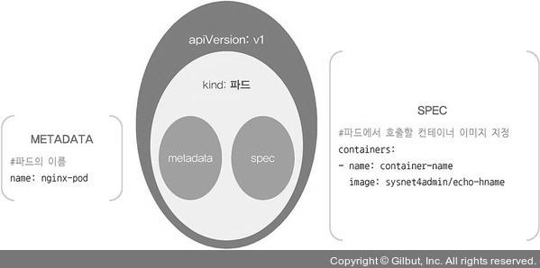

# 스펙(Spec)
> 오브젝트의 특성(설정정보)을 기술함, 커맨드 라인을 통해서 오브젝트 생성시 인자로 전달하여 정의하거나 또는 yaml이나 json 파일로 스펙을 정의할 수 있다.

## 스펙을 지정해 오브젝트 생성
```php
# echo-hname.yaml
apiVersion: apps/v1
kind: Deployment # 오브젝트 종류
metadata:
  name: echo-hname
  labels:
    app: nginx
spec:
  replicas: 3 # 몇 개의 파드를 생성할지 결정
  selector:
    matchLabels:
      app: nginx
  template:
    metadata:
      labels:
        app: nginx
    spec:
      containers
      - name: echo-hname
        image: sysnet4admin/echo-hname # 사용되는 이미지
```

<p align="center"></p>


### 오브젝트 생성 실습

#### 1번
```bash
[root@m-k8s ~]# kubectl create -f ~/_Book_k8sInfra/ch3/3.2.4/echo-hname.yaml
deployment.apps/echo-hname created
```
- echo-hname.yaml 파일을 이용해 디플로이먼트를 생성한다.

#### 2번
```bash
[root@m-k8s ~]# kubectl get pods
NAME                        READY   STATUS    RESTARTS   AGE
echo-hname-7894b67f-8gjpk   1/1     Running   0          2m17s
echo-hname-7894b67f-ldk89   1/1     Running   0          2m17s
echo-hname-7894b67f-ncg62   1/1     Running   0          2m17s
```
- echo-hname 파드가 3개인지 확인한다.

#### 3번
```bash
[root@m-k8s ~]# sed -i 's/replicas: 3/replicas: 6/' ~/_Book_k8sInfra/ch3/3.2.4/echo-hname.yaml
```
- sed(streamlined editor) : vi 편집기는 편집기를 열어 화면과 상호 작용하는 대화형 방식이지만 sed 편집기는 명령행에서 파일을 인자로 받아 명령어를 통해 작업한 후 결과를 화면으로 확인하는 방식
- sed 편집기는 쉘 리다이렉션을 이용해 편집 결과를 저장하기 전까지는 파일에 아무런 변경도 가하지 않는다.
- __-i 옵션__ : --in-place의 약어로 변경한 내용을 파일에 바로 적용하겠다는 옵션
- __s/__ : 주어진 패턴을 원하는 패턴으로 변경하겠다는 의미

#### 4번
```bash
[root@m-k8s ~]# cat ~/_Book_k8sInfra/ch3/3.2.4/echo-hname.yaml | grep replicas
  replicas: 6
```
- replicas 값이 3에서 6으로 변경된 것을 확인한다.

#### 5번
```bash
[root@m-k8s ~]# kubectl apply -f ~/_Book_k8sInfra/ch3/3.2.4/echo-hname.yaml
Warning: kubectl apply should be used on resource created by either kubectl create --save-config or kubectl apply
deployment.apps/echo-hname configured
```

- apply 명령어로 오브젝트를 변경할 수 있다.
- 이처럼 변경 사항이 발생할 수 있는 오브젝트는 처음부터 apply로 생성하는 것이 좋다.

#### 6번
```bash
[root@m-k8s ~]# kubectl get pods
NAME                        READY   STATUS    RESTARTS   AGE
echo-hname-7894b67f-4dmff   1/1     Running   0          71s
echo-hname-7894b67f-8gjpk   1/1     Running   0          9m40s
echo-hname-7894b67f-9cnpn   1/1     Running   0          71s
echo-hname-7894b67f-gfzs6   1/1     Running   0          71s
echo-hname-7894b67f-ldk89   1/1     Running   0          9m40s
echo-hname-7894b67f-ncg62   1/1     Running   0          9m40s
```

- echo-hname이 6개로 늘어났고, AGE를 통해 3개는 최근에 추가된 파드라는 것까지 확인할 수 있다.


