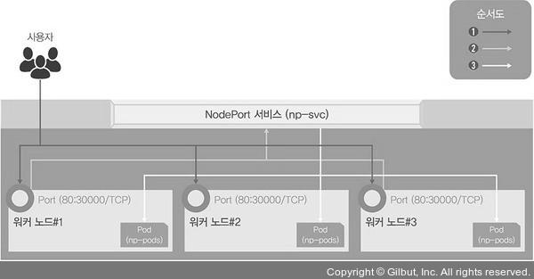
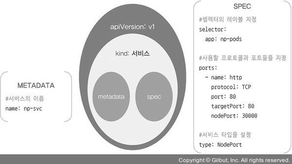
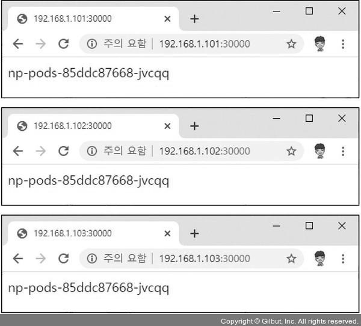
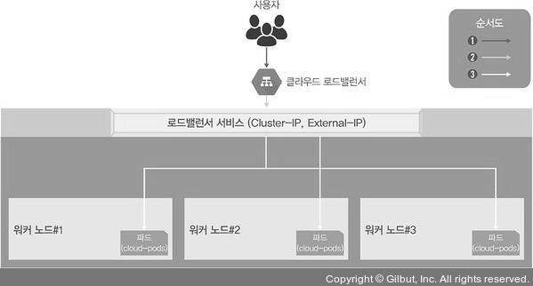
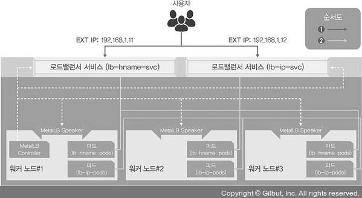
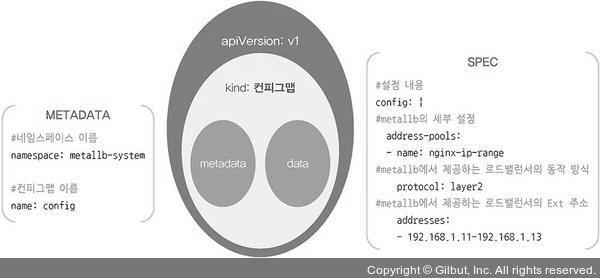

# 서비스(Service)
> 외부에서 쿠버네티스 클러스터에 접속하는 방법을 가리킨다.

## 서비스란?
- 여러 개의 파드에 접근할 수 있는 IP 하나를 제공한다. 파드가 클러스터 안 어디에 있든 고정 주소를 이용해 접근 가능하다.
- L4 영역에서 통신할 때 사용한다.
- 고정된 포인트 / 외부에서 접근 가능한 포인트를 제공한다.
- 크게 4가지 종류가 있다.

## 종류
### Cluster IP
- 기본 서비스 타입이며 클러스터 내부에서만 사용 가능하다.
- 클러스터 내부 노드나 파드에서는 클러스터 IP를 이용해 서비스에 연결된 파드에 접근한다.

### NodePort
- 서비스 하나에 모든 노드의 지정된 포트를 할당한다.
- 노드의 포트를 사용하므로 클러스터 내부뿐만 아니라 외부에서도 접근 가능하다.
- 클러스터 외부에서 내부 파드로 접근할 때 사용할 수 있는 가장 간단한 방법이다.

### LoadBalancer
- 클라우드에서 제공하는 로드밸런서와 파드를 연결한 후 해당 로드밸런서의 IP를 이용하여 클러스터 외부에서도 파드에 접근 가능하게 한다.
- 서비스 상태를 확인했을 때, EXTERNAL-IP 항목에 로드밸런서 IP를 표시한다.

### ExternalName
- 서비스를 .spec.externalName 필드에 설정한 값과 연결한다.
- 클러스터 내부에서 외부로 접근할 때 주로 이용한다.

## 노드포트
> 노드포트 서비스를 설정하면 노드의 특정 포트(노드포트)를 열고 여기로 오는 모든 요청을 노드포트 서비스로 전달한다. 그리고 노드포트 서비스는 해당 업무를 처리 가능한 파드로 요청을 전달한다.

<p align="center"></p>

### 노드포트 서비스로 외부에서 접속하기
#### 1) 디플로이먼트로 파드 생성
```bash
[root@m-k8s ~]# kubectl create deployment np-pods --image=sysnet4admin/echo-hname
deployment.apps/np-pods created
```

#### 2) 배포된 파드 확인
```bash
[root@m-k8s ~]# kubectl get pods
NAME                       READY   STATUS    RESTARTS   AGE
np-pods-5767d54d4b-km884   1/1     Running   0          63s
```

#### 3) 정의된 오브젝트 스펙을 활용하여 노드포트 서비스 생성
```bash
[root@m-k8s ~]# kubectl create -f ~/_Book_k8sInfra/ch3/3.3.1/nodeport.yaml
service/np-svc created
```
##### nodeport.yaml 파일 구조
<p align="center"></p>

#### 4) 노드포트 서비스로 생성한 np-svc 서비스 확인
```bash
[root@m-k8s ~]# kubectl get services
NAME         TYPE        CLUSTER-IP       EXTERNAL-IP   PORT(S)        AGE
kubernetes   ClusterIP   10.96.0.1        <none>        443/TCP        3d5h
np-svc       NodePort    10.100.165.139   <none>        80:30000/TCP   100s
```

#### 5) 쿠버네티스 클러스터의 워커 노드 IP 확인
```bash
[root@m-k8s ~]# kubectl get nodes -o wide
NAME     STATUS   ROLES    AGE    VERSION   INTERNAL-IP     EXTERNAL-IP   OS-IMAGE                KERNEL-VERSION                CONTAINER-RUNTIME
m-k8s    Ready    master   3d5h   v1.18.4   192.168.1.10    <none>        CentOS Linux 7 (Core)   3.10.0-1127.19.1.el7.x86_64   docker://1.13.1
w1-k8s   Ready    <none>   3d5h   v1.18.4   192.168.1.101   <none>        CentOS Linux 7 (Core)   3.10.0-1127.19.1.el7.x86_64   docker://1.13.1
w2-k8s   Ready    <none>   3d5h   v1.18.4   192.168.1.102   <none>        CentOS Linux 7 (Core)   3.10.0-1127.19.1.el7.x86_64   docker://1.13.1
w3-k8s   Ready    <none>   3d5h   v1.18.4   192.168.1.103   <none>        CentOS Linux 7 (Core)   3.10.0-1127.19.1.el7.x86_64   docker://1.13.1
```

#### 6) 워커노드의 IP와 노드포트의 포트 번호로 외부에서 내부로 접속이 가능한지 확인
<p align="center"></p>

- 파드가 하나이므로 화면에 보이는 이름이 모두 동일한 것을 확인할 수 있다.

### 부하 분산 테스트
- 노드포트의 오브젝트 스펙에 적힌 np-pods와 디플로이먼트의 이름을 확인해 동일하면 같은 파드라고 간주한다.

### expose로 노드포트 서비스 생성
#### 1) expose 명령어를 사용해 서비스로 내보낼 디플로이먼트를 np-pods로 지정
```bash
[root@m-k8s ~]# kubectl expose deployment np-pods --type=NodePort --name=np-svc-v2 --port=80
service/np-svc-v2 exposed
```

- type : NodePort로 지정하며 대소문자 구분해야함
- port : 서비스가 파드로 보내줄 연결 포트를 가리킨다.

#### 2) 포트 번호는 30000~32767에서 임의로 지정
```bash
[root@m-k8s ~]# kubectl get services
NAME         TYPE        CLUSTER-IP       EXTERNAL-IP   PORT(S)        AGE
kubernetes   ClusterIP   10.96.0.1        <none>        443/TCP        3d7h
np-svc       NodePort    10.100.165.139   <none>        80:30000/TCP   159m
np-svc-v2    NodePort    10.106.36.0      <none>        80:32147/TCP   142m
```

#### 3) 웹 브라우저를 띄우고 192.168.1.101:32147에 접속
- 배포된 파드 중 하나의 이름이 웹 브라우저에 표시되는 것을 확인할 수 있음

## 로드밸런서(LoadBalancer)

### 개요
- 노드포트와 인그레스는 들어오는 요청을 워커 노드의 노드포트를 통해 노드포트 서비스로 이동하고 이를 다시 쿠버네티스의 파드로 보내는 방식이고, 이는 비효율적이다.
- 로드밸런서라는 서비스 타입을 제공해 간단한 구조로 파드를 외부에 노출하고 부하를 분산시킨다.

<p align="center"></p>

- 로드밸런서를 사용하기 위해서는 로드밸런서를 이미 구현해 둔 서비스업체의 도움을 받아 쿠버네티스 클러스터 외부에 구현해야 한다.
- 테스트 가상환경(온프레미스)에서 로드밸런서를 사용하는 것에 대해 알아보자.

### MetalLB
- 온프레미스에서 로드밸런서를 사용하기 위해서는 내부에 로드밸런서 서비스를 받아주는 구성이 필요한데, 이것이 MetalLB이다.
- 베어메탈 환경에서 사용할 수 있는 로드밸런서를 제공하는 오픈소스 프로젝트이다. 클라우드 환경의 로드밸런서와는 동작이 조금 다르다.
- 로드밸런서의 External IP 전파를 위해 표준 프로토콜인 ARP(IPv4)/NDP(IPv6), BGP 를 사용한다.
    > ARP/NDP : L2 네트워크     /////      BGP : L3 네트워크
    
<p align="center"></p>

- MetalLB 스피커는 정해진 작동 방식(L2/ARP, L3/BGP)에 따라 경로를 만들 수 있도록 네트워크 정보를 광고하고 수집해 각 파드의 경로를 제공한다.


### MetalLB로 온프레미스 쿠버네티스 환경에서 로드밸런서 서비스 구성 과정
#### 1) 디플로이먼트를 이용해 두 종류의 파드 생성, 그 후 파드를 3개로 늘림
```bash
[root@m-k8s ~]# kubectl create deployment lb-hname-pods --image=sysnet4admin/echo-hname
deployment.apps/lb-hname-pods created
[root@m-k8s ~]# kubectl scale deployment lb-hname-pods --replicas=3
deployment.apps/lb-hname-pods scaled
[root@m-k8s ~]# kubectl create deployment lb-ip-pods --image=sysnet4admin/echo-ip
deployment.apps/lb-ip-pods created
[root@m-k8s ~]# kubectl scale deployment lb-ip-pods --replicas=3
deployment.apps/lb-ip-pods scaled
```

#### 2) 두 종류의 파드가 3개씩 총 6개가 배포되었는지 확인
#### 3) 사전에 정의된 오브젝트 스펙으로 MetalLB 구성, MetalLB에 필요한 요소 모두와 독립적인 네임스페이스 설치

```bash
[root@m-k8s ~]# kubectl apply -f ~/_Book_k8sInfra/ch3/3.3.4/metallb.yaml
namespace/metallb-system created
podsecuritypolicy.policy/speaker created
serviceaccount/controller created
serviceaccount/speaker created
clusterrole.rbac.authorization.k8s.io/metallb-system:controller created
clusterrole.rbac.authorization.k8s.io/metallb-system:speaker created
role.rbac.authorization.k8s.io/config-watcher created
clusterrolebinding.rbac.authorization.k8s.io/metallb-system:controller created
clusterrolebinding.rbac.authorization.k8s.io/metallb-system:speaker created
rolebinding.rbac.authorization.k8s.io/config-watcher created
daemonset.apps/speaker created
deployment.apps/controller created
```

#### 4) 배포된 MetalLB의 파드가 5개(controller 1개, speaker 4개)인지 확인하고, IP와 상태도 확인
```bash
[root@m-k8s ~]# kubectl get pods -n metallb-system -o wide
NAME                          READY   STATUS    RESTARTS   AGE   IP               NODE     NOMINATED NODE   READINESS GATES
controller-5d48db7f99-7zmvh   1/1     Running   0          34s   172.16.103.146   w2-k8s   <none>           <none>
speaker-98kxh                 1/1     Running   0          34s   192.168.1.101    w1-k8s   <none>           <none>
speaker-j48pv                 1/1     Running   0          34s   192.168.1.103    w3-k8s   <none>           <none>
speaker-l7jc2                 1/1     Running   0          34s   192.168.1.10     m-k8s    <none>           <none>
speaker-trkk9                 1/1     Running   0          34s   192.168.1.102    w2-k8s   <none>           <none>
```

#### 5) MetalLB 설정을 적용할 때 컨피그맵 사용
```bash
[root@m-k8s ~]# kubectl apply -f ~/_Book_k8sInfra/ch3/3.3.4/metallb-l2config.yaml
configmap/config created
```

<p align="center"></p>

#### 6) 컨피그맵 생성 확인
```bash
[root@m-k8s ~]# kubectl get configmap -n metallb-system
NAME     DATA   AGE
config   1      81s
```

#### 7) 각 디플로이먼트를 로드밸런서 서비스로 노출
```bash
[root@m-k8s ~]# kubectl expose deployment lb-hname-pods --type=LoadBalancer --name=lb-hname-svc --port=80
service/lb-hname-svc exposed
[root@m-k8s ~]# kubectl expose deployment lb-ip-pods --type=LoadBalancer --name=lb-ip-svc --port=80
service/lb-ip-svc exposed
```

#### 8) 생성된 로드밸런서 서비스별로 CLUSTER-IP와 EXTERNAL-IP(컨피그맵을 통해 부여된)가 잘 적용됐는지 확인
```bash
[root@m-k8s ~]# kubectl get services
NAME           TYPE           CLUSTER-IP       EXTERNAL-IP    PORT(S)        AGE
kubernetes     ClusterIP      10.96.0.1        <none>         443/TCP        3d10h
lb-hname-svc   LoadBalancer   10.99.205.146    192.168.1.11   80:30649/TCP   2m37s
lb-ip-svc      LoadBalancer   10.103.131.128   192.168.1.12   80:31951/TCP   2m19s
```

#### 9) EXTERNAL-IP 작동 확인

#### 10) 로드밸런서 기능 검증


