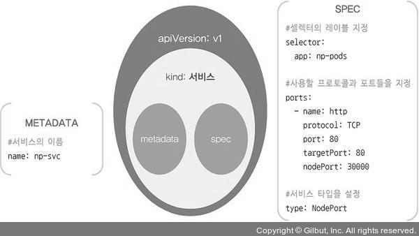
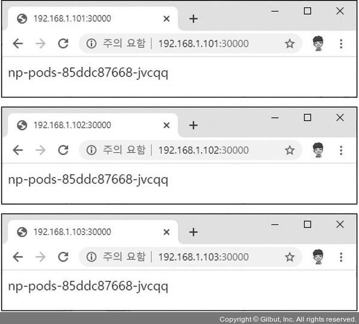
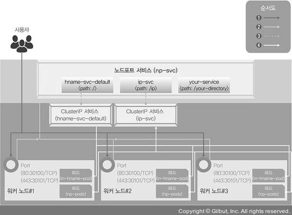
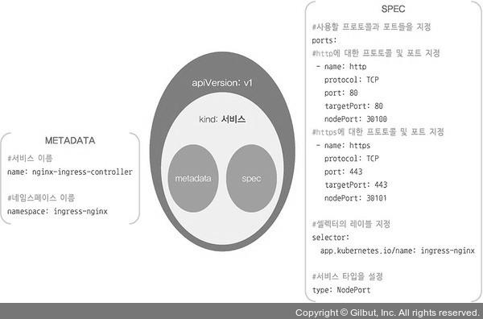
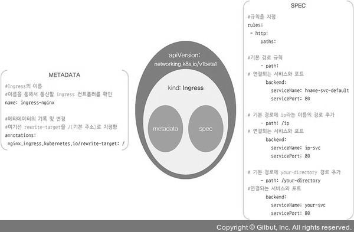

# 서비스(Service)
> 외부에서 쿠버네티스 클러스터에 접속하는 방법을 가리킨다.

## 서비스란?
- 여러 개의 파드에 접근할 수 있는 IP 하나를 제공한다. 파드가 클러스터 안 어디에 있든 고정 주소를 이용해 접근 가능하다.
- L4 영역에서 통신할 때 사용한다.
- 고정된 포인트 / 외부에서 접근 가능한 포인트를 제공한다.
- 크게 4가지 종류가 있다.

## 종류
### Cluster IP
- 기본 서비스 타입이며 클러스터 내부에서만 사용 가능하다.
- 클러스터 내부 노드나 파드에서는 클러스터 IP를 이용해 서비스에 연결된 파드에 접근한다.

### NodePort
- 서비스 하나에 모든 노드의 지정된 포트를 할당한다.
- 노드의 포트를 사용하므로 클러스터 내부뿐만 아니라 외부에서도 접근 가능하다.
- 클러스터 외부에서 내부 파드로 접근할 때 사용할 수 있는 가장 간단한 방법이다.

### LoadBalancer
- 클라우드에서 제공하는 로드밸런서와 파드를 연결한 후 해당 로드밸런서의 IP를 이용하여 클러스터 외부에서도 파드에 접근 가능하게 한다.
- 서비스 상태를 확인했을 때, EXTERNAL-IP 항목에 로드밸런서 IP를 표시한다.

### ExternalName
- 서비스를 .spec.externalName 필드에 설정한 값과 연결한다.
- 클러스터 내부에서 외부로 접근할 때 주로 이용한다.

## 노드포트
> 노드포트 서비스를 설정하면 노드의 특정 포트(노드포트)를 열고 여기로 오는 모든 요청을 노드포트 서비스로 전달한다. 그리고 노드포트 서비스는 해당 업무를 처리 가능한 파드로 요청을 전달한다.

<p align="center"></p>

### 노드포트 서비스로 외부에서 접속하기
#### 1) 디플로이먼트로 파드 생성
```bash
[root@m-k8s ~]# kubectl create deployment np-pods --image=sysnet4admin/echo-hname
deployment.apps/np-pods created
```

#### 2) 배포된 파드 확인
```bash
[root@m-k8s ~]# kubectl get pods
NAME                       READY   STATUS    RESTARTS   AGE
np-pods-5767d54d4b-km884   1/1     Running   0          63s
```

#### 3) 정의된 오브젝트 스펙을 활용하여 노드포트 서비스 생성
```bash
[root@m-k8s ~]# kubectl create -f ~/_Book_k8sInfra/ch3/3.3.1/nodeport.yaml
service/np-svc created
```
##### nodeport.yaml 파일 구조
<p align="center"></p>

#### 4) 노드포트 서비스로 생성한 np-svc 서비스 확인
```bash
[root@m-k8s ~]# kubectl get services
NAME         TYPE        CLUSTER-IP       EXTERNAL-IP   PORT(S)        AGE
kubernetes   ClusterIP   10.96.0.1        <none>        443/TCP        3d5h
np-svc       NodePort    10.100.165.139   <none>        80:30000/TCP   100s
```

#### 5) 쿠버네티스 클러스터의 워커 노드 IP 확인
```bash
[root@m-k8s ~]# kubectl get nodes -o wide
NAME     STATUS   ROLES    AGE    VERSION   INTERNAL-IP     EXTERNAL-IP   OS-IMAGE                KERNEL-VERSION                CONTAINER-RUNTIME
m-k8s    Ready    master   3d5h   v1.18.4   192.168.1.10    <none>        CentOS Linux 7 (Core)   3.10.0-1127.19.1.el7.x86_64   docker://1.13.1
w1-k8s   Ready    <none>   3d5h   v1.18.4   192.168.1.101   <none>        CentOS Linux 7 (Core)   3.10.0-1127.19.1.el7.x86_64   docker://1.13.1
w2-k8s   Ready    <none>   3d5h   v1.18.4   192.168.1.102   <none>        CentOS Linux 7 (Core)   3.10.0-1127.19.1.el7.x86_64   docker://1.13.1
w3-k8s   Ready    <none>   3d5h   v1.18.4   192.168.1.103   <none>        CentOS Linux 7 (Core)   3.10.0-1127.19.1.el7.x86_64   docker://1.13.1
```

#### 6) 워커노드의 IP와 노드포트의 포트 번호로 외부에서 내부로 접속이 가능한지 확인
<p align="center"></p>

- 파드가 하나이므로 화면에 보이는 이름이 모두 동일한 것을 확인할 수 있다.

### 부하 분산 테스트
- 노드포트의 오브젝트 스펙에 적힌 np-pods와 디플로이먼트의 이름을 확인해 동일하면 같은 파드라고 간주한다.

### expose로 노드포트 서비스 생성
#### 1) expose 명령어를 사용해 서비스로 내보낼 디플로이먼트를 np-pods로 지정
```bash
[root@m-k8s ~]# kubectl expose deployment np-pods --type=NodePort --name=np-svc-v2 --port=80
service/np-svc-v2 exposed
```

- type : NodePort로 지정하며 대소문자 구분해야함
- port : 서비스가 파드로 보내줄 연결 포트를 가리킨다.

#### 2) 포트 번호는 30000~32767에서 임의로 지정
```bash
[root@m-k8s ~]# kubectl get services
NAME         TYPE        CLUSTER-IP       EXTERNAL-IP   PORT(S)        AGE
kubernetes   ClusterIP   10.96.0.1        <none>        443/TCP        3d7h
np-svc       NodePort    10.100.165.139   <none>        80:30000/TCP   159m
np-svc-v2    NodePort    10.106.36.0      <none>        80:32147/TCP   142m
```

#### 3) 웹 브라우저를 띄우고 192.168.1.101:32147에 접속
- 배포된 파드 중 하나의 이름이 웹 브라우저에 표시되는 것을 확인할 수 있음

## 인그레스(Ingress)
> 클러스터 외부에서 내부의 파드에 접근할 때 사용하는 방법으로써, 서비스와의 차이점은 주로 L7 영역의 통신을 담당해 처리한다는 것이다.

### 인그레스 컨트롤러 동작 방식
<p align="center"></p>

1. 사용자는 노드마다 설정된 노드포트를 통해 노드포트 서비스로 접속한다. 이 때, 노드포트 서비스를 NGINX 인그레스 컨트롤러로 구성한다.
2. NGINX 인그레스 컨트롤러는 사용자의 접속 경로에 따라 적합한 클러스터 IP 서비스로 경로를 제공한다.
3. 클러스터 IP 서비스는 사용자를 해당 파드로 연결한다.

### 실습
#### 1) 테스트용으로 디플로이먼트 두 개 배포
```bash
[root@m-k8s ~]# kubectl create deployment in-hname-pod --image=sysnet4admin/echo-hname
deployment.apps/in-hname-pod created
[root@m-k8s ~]# kubectl create deployment in-ip-pod --image=sysnet4admin/echo-ip
deployment.apps/in-ip-pod created
```

#### 2) 배포된 파드의 상태 확인
```bash
[root@m-k8s ~]# kubectl get pods
NAME                            READY   STATUS    RESTARTS   AGE
in-hname-pod-8565c86448-wvtpx   1/1     Running   0          3m6s
in-ip-pod-76bf6989d-g2nxw       1/1     Running   0          2m52s
```

#### 3) nginx 인그레스 컨트롤러 설치 (많은 오브젝트 스펙이 포함되어 있음)
```bash
[root@m-k8s ~]# kubectl apply -f ~/_Book_k8sInfra/ch3/3.3.2/ingress-nginx.yaml
namespace/ingress-nginx created
configmap/nginx-configuration created
configmap/tcp-services created
configmap/udp-services created
serviceaccount/nginx-ingress-serviceaccount created
clusterrole.rbac.authorization.k8s.io/nginx-ingress-clusterrole created
role.rbac.authorization.k8s.io/nginx-ingress-role created
rolebinding.rbac.authorization.k8s.io/nginx-ingress-role-nisa-binding created
clusterrolebinding.rbac.authorization.k8s.io/nginx-ingress-clusterrole-nisa-binding created
deployment.apps/nginx-ingress-controller created
limitrange/ingress-nginx created
```

#### 4) nginx 인그레스 컨트롤러 파드 배포 확인
```bash
[root@m-k8s ~]# kubectl get pods -n ingress-nginx
NAME                                        READY   STATUS    RESTARTS   AGE
nginx-ingress-controller-5bb8fb4bb6-l8hkf   1/1     Running   0          117s
```
- -n : namespace의 약자로, default 외의 네임스페이스를 확인할 때 사용하는 옵션이다.

#### 5) 인그레스를 사용자 요구 사항에 맞게 설정하기 위해 경로와 작동 정의
```bash
[root@m-k8s ~]# kubectl apply -f ~/_Book_k8sInfra/ch3/3.3.2/ingress-config.yaml
ingress.networking.k8s.io/ingress-nginx created
```

##### ingress-config.yaml 파일 구조
<p align="center"></p>


#### 6) 인그레스 설정 파일이 제대로 등록됐는지 확인
```bash
[root@m-k8s ~]# kubectl get ingress
NAME            CLASS    HOSTS   ADDRESS   PORTS   AGE
ingress-nginx   <none>   *                 80      5m2s
```

#### 7) 외부에서 NGINX 인그레스 컨트롤러에 접속할 수 있게 노드포트 서비스로 인그레스 컨트롤러를 외부에 노출
```bash
[root@m-k8s ~]# kubectl apply -f ~/_Book_k8sInfra/ch3/3.3.2/ingress.yaml
service/nginx-ingress-controller created
```

##### ingress.yaml 파일 구조
<p align="center"></p>

#### 8) 노드포트 서비스로 생성된 nginx-ingress-controller를 확인
```bash
[root@m-k8s ~]# kubectl get services -n ingress-nginx
NAME                       TYPE       CLUSTER-IP      EXTERNAL-IP   PORT(S)                      AGE
nginx-ingress-controller   NodePort   10.98.158.179   <none>        80:30100/TCP,443:30101/TCP   11m
```

#### 9) expose 명령으로 in-hname-pod, in-ip-pod 디플로이먼트를 서비스로 노출
```bash
[root@m-k8s ~]# kubectl expose deployment in-hname-pod --name=hname-svc-default --port=80,443
service/hname-svc-default exposed
[root@m-k8s ~]# kubectl expose deployment in-ip-pod --name=ip-svc --port=80,443
service/ip-svc exposed
```

#### 10) 생성된 서비스를 점검해 디플로이먼트들이 서비스에 정상적으로 노출되는지 확인
```bash
[root@m-k8s ~]# kubectl get services
NAME                TYPE        CLUSTER-IP       EXTERNAL-IP   PORT(S)          AGE
hname-svc-default   ClusterIP   10.97.238.207    <none>        80/TCP,443/TCP   9m54s
ip-svc              ClusterIP   10.111.139.186   <none>        80/TCP,443/TCP   9m27s
kubernetes          ClusterIP   10.96.0.1        <none>        443/TCP          3d9h
```
- 새로 생성된 서비스는 default 네임스페이스에 있으므로 -n 옵션으로 네임스페이스를 따로 지정하지 않아도 된다.

#### 11) 워커노드 ip와 노드포트를 사용해 파드의 ip가 반환되는지를 확인한다.


