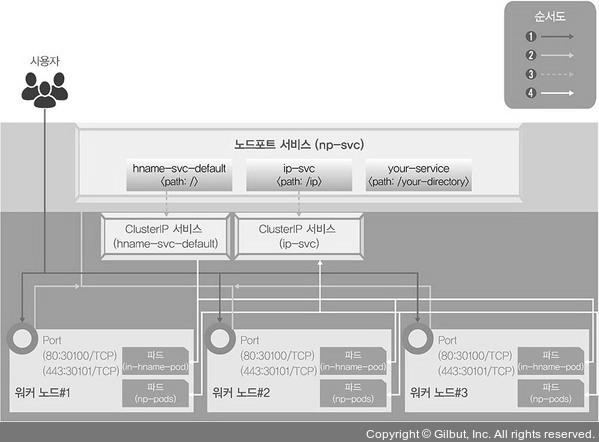
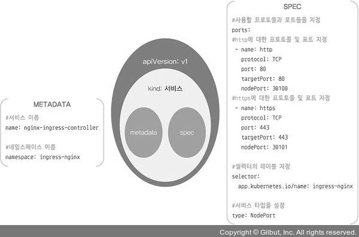
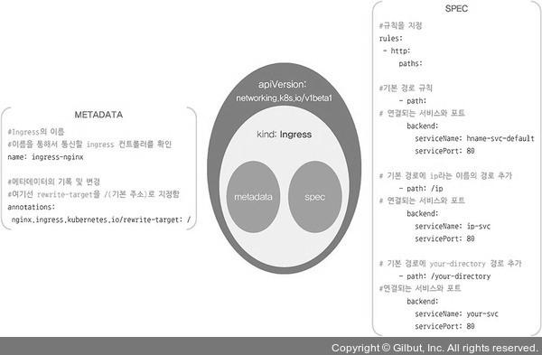

# 인그레스 (Ingress)
> 클러스터 외부에서 내부의 파드에 접근할 때 사용하는 방법으로써, 서비스와의 차이점은 주로 L7 영역의 통신을 담당해 처리한다는 것이다.

## 인그레스 컨트롤러 동작 방식
<p align="center"></p>

1. 사용자는 노드마다 설정된 노드포트를 통해 노드포트 서비스로 접속한다. 이 때, 노드포트 서비스를 NGINX 인그레스 컨트롤러로 구성한다.
2. NGINX 인그레스 컨트롤러는 사용자의 접속 경로에 따라 적합한 클러스터 IP 서비스로 경로를 제공한다.
3. 클러스터 IP 서비스는 사용자를 해당 파드로 연결한다.

## 실습
#### 1) 테스트용으로 디플로이먼트 두 개 배포
```bash
[root@m-k8s ~]# kubectl create deployment in-hname-pod --image=sysnet4admin/echo-hname
deployment.apps/in-hname-pod created
[root@m-k8s ~]# kubectl create deployment in-ip-pod --image=sysnet4admin/echo-ip
deployment.apps/in-ip-pod created
```

#### 2) 배포된 파드의 상태 확인
```bash
[root@m-k8s ~]# kubectl get pods
NAME                            READY   STATUS    RESTARTS   AGE
in-hname-pod-8565c86448-wvtpx   1/1     Running   0          3m6s
in-ip-pod-76bf6989d-g2nxw       1/1     Running   0          2m52s
```

#### 3) nginx 인그레스 컨트롤러 설치 (많은 오브젝트 스펙이 포함되어 있음)
```bash
[root@m-k8s ~]# kubectl apply -f ~/_Book_k8sInfra/ch3/3.3.2/ingress-nginx.yaml
namespace/ingress-nginx created
configmap/nginx-configuration created
configmap/tcp-services created
configmap/udp-services created
serviceaccount/nginx-ingress-serviceaccount created
clusterrole.rbac.authorization.k8s.io/nginx-ingress-clusterrole created
role.rbac.authorization.k8s.io/nginx-ingress-role created
rolebinding.rbac.authorization.k8s.io/nginx-ingress-role-nisa-binding created
clusterrolebinding.rbac.authorization.k8s.io/nginx-ingress-clusterrole-nisa-binding created
deployment.apps/nginx-ingress-controller created
limitrange/ingress-nginx created
```

#### 4) nginx 인그레스 컨트롤러 파드 배포 확인
```bash
[root@m-k8s ~]# kubectl get pods -n ingress-nginx
NAME                                        READY   STATUS    RESTARTS   AGE
nginx-ingress-controller-5bb8fb4bb6-l8hkf   1/1     Running   0          117s
```
- -n : namespace의 약자로, default 외의 네임스페이스를 확인할 때 사용하는 옵션이다.

#### 5) 인그레스를 사용자 요구 사항에 맞게 설정하기 위해 경로와 작동 정의
```bash
[root@m-k8s ~]# kubectl apply -f ~/_Book_k8sInfra/ch3/3.3.2/ingress-config.yaml
ingress.networking.k8s.io/ingress-nginx created
```

##### ingress-config.yaml 파일 구조
<p align="center"></p>


#### 6) 인그레스 설정 파일이 제대로 등록됐는지 확인
```bash
[root@m-k8s ~]# kubectl get ingress
NAME            CLASS    HOSTS   ADDRESS   PORTS   AGE
ingress-nginx   <none>   *                 80      5m2s
```

#### 7) 외부에서 NGINX 인그레스 컨트롤러에 접속할 수 있게 노드포트 서비스로 인그레스 컨트롤러를 외부에 노출
```bash
[root@m-k8s ~]# kubectl apply -f ~/_Book_k8sInfra/ch3/3.3.2/ingress.yaml
service/nginx-ingress-controller created
```

##### ingress.yaml 파일 구조
<p align="center"></p>

#### 8) 노드포트 서비스로 생성된 nginx-ingress-controller를 확인
```bash
[root@m-k8s ~]# kubectl get services -n ingress-nginx
NAME                       TYPE       CLUSTER-IP      EXTERNAL-IP   PORT(S)                      AGE
nginx-ingress-controller   NodePort   10.98.158.179   <none>        80:30100/TCP,443:30101/TCP   11m
```

#### 9) expose 명령으로 in-hname-pod, in-ip-pod 디플로이먼트를 서비스로 노출
```bash
[root@m-k8s ~]# kubectl expose deployment in-hname-pod --name=hname-svc-default --port=80,443
service/hname-svc-default exposed
[root@m-k8s ~]# kubectl expose deployment in-ip-pod --name=ip-svc --port=80,443
service/ip-svc exposed
```

#### 10) 생성된 서비스를 점검해 디플로이먼트들이 서비스에 정상적으로 노출되는지 확인
```bash
[root@m-k8s ~]# kubectl get services
NAME                TYPE        CLUSTER-IP       EXTERNAL-IP   PORT(S)          AGE
hname-svc-default   ClusterIP   10.97.238.207    <none>        80/TCP,443/TCP   9m54s
ip-svc              ClusterIP   10.111.139.186   <none>        80/TCP,443/TCP   9m27s
kubernetes          ClusterIP   10.96.0.1        <none>        443/TCP          3d9h
```
- 새로 생성된 서비스는 default 네임스페이스에 있으므로 -n 옵션으로 네임스페이스를 따로 지정하지 않아도 된다.

#### 11) 워커노드 ip와 노드포트를 사용해 파드의 ip가 반환되는지를 확인한다.
