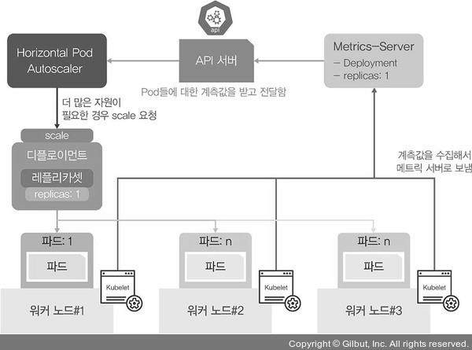

# HPA (Horizontal Pod Autoscaler)
> 부하량에 따라 디플로이먼트의 파드 수를 유동적으로 관리하는 기능

## HPA 사용
### 1) 디플로이먼트 1개를 생성
```bash
[root@m-k8s ~]# kubectl create deployment hpa-hname-pods --image=sysnet4admin/echo-hname
deployment.apps/hpa-hname-pods created
```

### 2) 이미 구성된 MetalLB를 expose를 실행해 hpa-hname-pods를 로드밸런서 서비스로 설정
```bash
[root@m-k8s ~]# kubectl expose deployment hpa-hname-pods --type=LoadBalancer --name=hpa-hname-svc --port=80
service/hpa-hname-svc exposed
```

### 3) 로드밸런서 서비스와 부여된 IP 확인
```bash
[root@m-k8s ~]# kubectl get services
NAME            TYPE           CLUSTER-IP       EXTERNAL-IP    PORT(S)        AGE
hpa-hname-svc   LoadBalancer   10.103.116.146   192.168.1.11   80:30013/TCP   29s
kubernetes      ClusterIP      10.96.0.1        <none>         443/TCP        4d4h
```

### 4) 부하를 확인하기 위해 리눅스의 top(table of processes)과 비슷한 kubectl top pods 사용
```bash
[root@m-k8s ~]# kubectl top pods
Error from server (NotFound): the server could not find the requested resource (get services http:heapster:)
```
- 왜 에러가 발생하는지 HPA 작동 구조를 통해 알아보자.

<p align="center"></p>

- HPA가 자원을 요청할 때 메트릭 서버를 통해 계측값을 전달받는다. 따라서, 메트릭 서버가 없기 때문에 에러가 발생한다.

### 5) 메트릭 서버 설치
```bash
[root@m-k8s ~]# kubectl create -f ~/_Book_k8sInfra/ch3/3.3.5/metrics-server.yaml
clusterrole.rbac.authorization.k8s.io/system:aggregated-metrics-reader created
clusterrolebinding.rbac.authorization.k8s.io/metrics-server:system:auth-delegator created
rolebinding.rbac.authorization.k8s.io/metrics-server-auth-reader created
apiservice.apiregistration.k8s.io/v1beta1.metrics.k8s.io created
serviceaccount/metrics-server created
deployment.apps/metrics-server created
service/metrics-server created
clusterrole.rbac.authorization.k8s.io/system:metrics-server created
clusterrolebinding.rbac.authorization.k8s.io/system:metrics-server created
```

### 6) kubectl top pods 결과 확인
```bash
[root@m-k8s ~]# kubectl top pods
NAME                              CPU(cores)   MEMORY(bytes)
hpa-hname-pods-75f874d48c-hc7xw   0m           1Mi
```

- scale 기준 값이 설정되어 있지 않아서 파드 증설 시점을 알 수 없다.
- 따라서 파드에 부하가 걸리기 전에 scale이 실행되도록 디플로이먼트에 기준 값을 기록한다.

### 7) edit 명령을 실행해 배포된 디플로이먼트 내용을 확인한다.
- resources 부분에서 requests, limits 항목과 값을 추가한다.
- 10m은 0.01 CPU 사용을 기준으로 파드를 증설하게 설정한 것이다.

### 8) kubectl top pods 결과 재확인
```bash
[root@m-k8s ~]# kubectl top pods
NAME                              CPU(cores)   MEMORY(bytes)
hpa-hname-pods-696b8fcc99-kkk7t   0m           1Mi
```

- 스펙이 edit 명령으로 인해 변경됨에 따라 새로운 파드가 생성되었음을 확인할 수 있다.

### 9) autoscale 명령으로 특정 조건이 만족될 때 자동으로 scale 명령 수행되도록 설정
```bash
[root@m-k8s ~]# kubectl autoscale deployment hpa-hname-pods --min=1 --max=30 --cpu-percent=50
horizontalpodautoscaler.autoscaling/hpa-hname-pods autoscaled
```
- min은 최소 파드의 수이고, max는 최대 파드의 수이다.
- cpu-percent는 CPU 사용량이 50%를 넘게 되면 autoscale 한다는 의미이다.

### 10) HPA를 테스트하기 위한 파워셸 창에서 반복문 실행
```bash
PS C:\Users\Administrator>
>> $i=0; while($true)
>> {
>> % { $i++; write-host -NoNewline "$i $_" }
>> (Invoke-RestMethod "http://192.168.1.11")-replace '\n', " "
>> }
```

### 11) 부하량에 따라 파드 상태 확인
- watch kubectl top pods 와 watch kubectl get pods 명령어로 상태를 실시간 확인한다.
- 부하가 늘어남에 따라 파드가 새로 생성된다.
- 일정 시간이 지난 후 더 이상 부하가 없으면 autoscale의 최소 조건인 파드 1개의 상태로 돌아가기 위해 파드가 종료되는 것을 확인한다.


